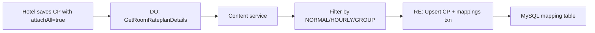
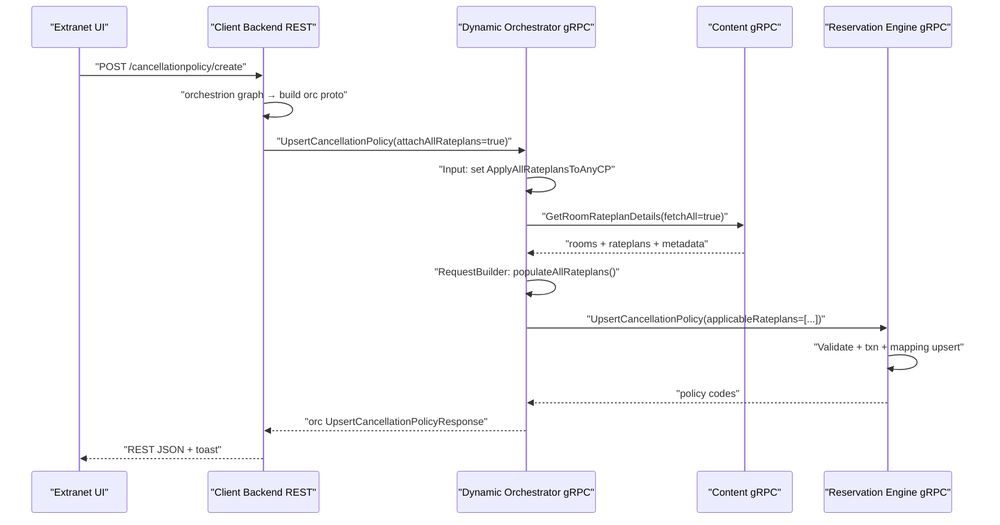
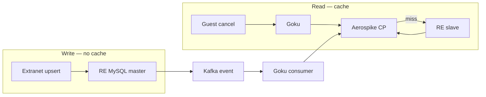
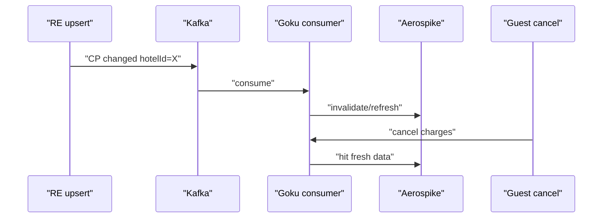

# Cred Interview — Cancellation Policy Enhancement (MMT / INGO)

Deep-dive Q&A for: **attach cancellation policy (CP) to missing rate plans**, gRPC stack, graph orchestrator, scale, and design trade-offs.

**Stack:** Extranet UI → **CB** (REST BFF) → **DO** (gRPC orchestrator) → **RE** (gRPC + MySQL) + **Content** (room/rateplan truth).

---

## Table of contents

1. [Why was this problem important for MMT?](#q1-why-was-this-problem-important-for-mmt)
2. [Key challenges and motivation](#q2-key-challenges-and-motivation)
3. [Technical choices — options vs what we chose](#q3-technical-choices--options-vs-what-we-chose)
4. [gRPC layer — what was the solution?](#q4-grpc-layer--what-was-the-solution)
5. [Why graph orchestrator (DO)?](#q5-why-graph-orchestrator-do)
6. [If UI already uses orchestrator — what would you do?](#q6-if-ui-already-uses-orchestrator--what-would-you-do)
7. [What is the scale?](#q7-what-is-the-scale)
8. [Scale of cancellation APIs specifically](#q8-scale-of-cancellation-apis-specifically)
9. [50 lakh hotels — same approach or different?](#q9-50-lakh-hotels--same-approach-or-different)
10. [Where would you use cache — for what?](#q10-where-would-you-use-cache--for-what)
11. [Where is data stored today? Why add cache?](#q11-where-is-data-stored-today-why-add-cache)
12. [How do you know data changed on the service side?](#q12-how-do-you-know-data-changed-on-the-service-side)
13. [Cache in our system or theirs?](#q13-cache-in-our-system-or-theirs)
14. [If we cache their response — how do updates work?](#q14-if-we-cache-their-response--how-do-updates-work)
15. [How long did implementation take?](#q15-how-long-did-implementation-take)
16. [How do you test and ensure it works?](#q16-how-do-you-test-and-ensure-it-works)
17. [Short TTL — unnecessary DB hits to refresh?](#q17-short-ttl--unnecessary-db-hits-to-refresh)
18. [SDE-2 technical learning checklist](#q18-sde-2-technical-learning-checklist)

---

## Q1. Why was this problem important for MMT?

### Business problem (plain English)

A **rate plan without a mapped cancellation policy** is treated as **non-refundable** on consumer flows. That is legally and commercially risky:

| Impact | What happens |
|--------|----------------|
| **Guest experience** | Search/review shows harsh NR policy; free-cancel hotels look worse than reality |
| **Hotel ops** | Hotel created CP but forgot to link 3 of 12 rate plans → those rooms sell with wrong refund rules |
| **Revenue / trust** | Wrong cancellation quote at booking → disputes, chargebacks, support tickets |
| **Compliance** | Refund rules must match what hotel configured on extranet |

Extranet listing page literally warns:

> *"As currently no cancellation policy has been set, all your rate plans are Non-refundable"*

And per-policy:

> *"You have not assigned any rateplans to this cancellation policy."*

### Data model

Three tables work together (RE / `goibibo_inventory`):

| Table | Role |
|-------|------|
| `hotels_cancellation_policy` | Policy definition (rule code, vendor, type) |
| `hotels_rateplan_cancellation_mapping` | **Which rate plan uses which policy** |
| `hotels_cancellation_blackout_dates` | Peak-date overrides |

**Policy exists ≠ rate plan covered.** Mapping row in `hotels_rateplan_cancellation_mapping` is what Goku/RE use at quote time.

### Why enhancement mattered

Hotels frequently:

1. Create a **new rate plan** (ARI/bulk/partner sync) and forget to map CP
2. Create CP on extranet but manually attach only **some** rate plans
3. Run migrations / ZCR / grace policy flows where **bulk attach** is required

**Enhancement:** `attachAllRateplans` — server auto-discovers all eligible rate plans for the hotel and writes mappings in one upsert, instead of hotel picking each RP in UI.

**Interview one-liner:**

> "Unmapped rate plans default to non-refundable on consumer search. At MMT scale that's revenue and compliance risk. We closed the gap by server-side bulk attach with content-validated rate plan lists."

---

## Q2. Key challenges and motivation

### Challenges

| # | Challenge | Why hard |
|---|-----------|----------|
| 1 | **Many rate plans per hotel** | 10–40 RPs across rooms, meal plans, BAR, corporate, hourly slot rooms |
| 2 | **Policy types differ** | NORMAL vs HOURLY vs GROUP vs GRACE — each attaches different RP sets |
| 3 | **Rate plan ownership** | RP must belong to hotel — can't trust client-sent IDs alone |
| 4 | **Existing mappings** | Upsert must INSERT new + UPDATE existing mapping rows, not duplicate |
| 5 | **Multi-service write** | Policy body in RE; rate plan list from **Content**; orchestration in DO |
| 6 | **UI + App + Common API** | Web extranet, mobile app, internal common API — same backend rules |
| 7 | **Transactional integrity** | Policy + blackout + mappings in **one RE transaction** |
| 8 | **Default NR behavior** | Missing mapping is silent failure — hard to detect without listing UX |

### Motivation for `AttachAllRateplans`

**Before:** Hotel creates CP → navigates to rate plan page → manually assigns → easy to miss new RPs.

**After:** Flag `attachAllRateplans: true` on upsert → DO fetches all room/rate plans from Content → filters by policy type → RE upserts mappings for **every eligible RP**.



### Policy-type filtering (core complexity)

From DO `request_builder.go` — not all rate plans get every policy:

| Policy type | Rate plans attached |
|-------------|---------------------|
| **NORMAL** | Non-slot rooms; exclude `contractType = grp` |
| **HOURLY** | Slot rooms only (`IsSlotRoom`) |
| **GROUP** | `contractType = grp` only |
| **GRACE / SCP / GROUP policy** | **No** rate plan attach (validator blocks) |

This is why server-side discovery must understand **room metadata**, not just a flat RP list from UI.

---

## Q3. Technical choices — options vs what we chose

| Decision | Options considered | **What we chose** | Why |
|----------|-------------------|-------------------|-----|
| **Who discovers rate plans?** | (A) UI sends full list (B) DO fetches from Content | **(B) DO + Content** | UI can be stale; new RP after page load would still miss; server is source of truth |
| **Where to orchestrate?** | (A) CB only (B) DO graph (C) RE only | **(B) DO graph** | Needs Content call **before** RE upsert; reusable `GetRoomRateplanDetails` node |
| **Where to persist?** | Inventory Django vs RE | **RE** | CP module owned by RE; transactional DAO |
| **Attach flag** | Implicit "attach all on create" vs explicit flag | **`AttachAllRateplans` proto field** | Backward compatible; manual attach still works |
| **Validation** | Trust client IDs vs Content lookup | **Content `GetRoomRateplans`** in RE validator | Prevents cross-hotel RP injection |
| **Graph skip** | Always call Content | **Skip `GetRoomRateplanDetails` when flag false** | No extra latency on manual attach path |
| **Multi CP attach-all** | Allow many | **Reject if >1 CP has attachAll in one request** | Ambiguous ownership — one bulk attach per request |
| **Mapping upsert** | Delete-all + insert vs diff | **Diff INSERT/UPDATE** in `HandleUpsertApplicableRateplan` | Preserves mapping IDs; PATCH-friendly |

### DB write pattern (RE)

```
BEGIN TXN
  INSERT/UPDATE hotels_cancellation_policy
  INSERT/UPDATE blackout rows
  FOR each applicable rateplan:
    INSERT new mapping OR UPDATE existing (policyId, isActive)
COMMIT
```

All `modifiedBy` from auth context.

---

## Q4. gRPC layer — what was the solution?

HR is asking: **how did you wire services, not REST handlers.**

### Layered gRPC flow



### Proto contracts (shared `Hotels-Proto` repo)

| Hop | Service / package |
|-----|-------------------|
| CB → DO | `dynamicorchestrator/cancellationpolicy/orcupsertcp` |
| DO → RE | `reservationengine/cancellationpolicy/upsertcp` |
| DO → Content | `enigma/content` — `RoomRatePlanResponse` |
| Goku → RE (read path) | `getapplicablecp` — quote at cancel time |

### Key proto field (enhancement)

```protobuf
// orcupsertcp.CancellationPolicy
bool attachAllRateplans = 10;
```

App request builder maps:

```go
AttachAllRateplans: appUpsertRequestBody.AdditionalData.AttachAllRatePlans
```

### DO graph nodes (`UpsertCancellationPolicyNodeConfigs`)

```
InputHandler
  → GetRoomRateplanDetails  (skipped if attachAll=false)
  → UpsertCancellationPoliciesNode  (validator → request builder → RE network call → transformer)
  → OutputHandler
```

### RE gRPC service responsibilities

| Method | Role |
|--------|------|
| `UpsertCancellationPolicy` | Write policy + mappings (enhancement path) |
| `GetCancellationPolicy` | Read policies + `applicableRateplans` for listing |
| `GetApplicableCancellationPolicy` | **Runtime** — Goku cancel quote; batch hotels |

### Why gRPC between layers

- Typed contracts across 3 repos (CB, DO, RE)
- Header propagation (`userid`, `requestid`, `platform`, hotel scope)
- Independent deploy/version of BFF vs orchestrator vs data service
- RE stays **internal** — only DO/CB call it, not browser

**Interview answer:**

> "gRPC solution was a 3-hop pipeline: CB builds orchestrator proto, DO optionally calls Content for full room-rateplan tree, transforms to RE upsert proto with populated `applicableRateplans`, RE runs one transaction on policy + mapping tables."

---

## Q5. Why graph orchestrator (DO)?

### Reasons specific to this feature

| Reason | Explanation |
|--------|-------------|
| **Ordered dependency** | Must fetch rate plans **before** building RE request — graph `DependsOnNodes` enforces this |
| **Conditional execution** | `SetSkipNodes(GetRoomRateplanDetails)` when `attachAllRateplans=false` — no wasted Content call |
| **Reusable node** | `GetRoomRateplanDetails` shared across ZCR, ARI, loyalty, CP — same Content integration |
| **Single controller** | `UpsertCancellationPolicyController` — graph construct, parallel control, datastore response |
| **Cross-cutting validation** | DO validator (hotel ID) → node validator → RE deep validation |
| **Platform pattern** | MMT extranet standard: CB graph for UI shaping, DO graph for backend fan-out |

### What orchestrator is NOT doing here

- Not replacing RE business logic — RE still owns rules, txn, DAO
- Not on consumer search hot path — extranet write only
- Not Kafka/async — synchronous extranet save (user waits for toast)

### CB also uses orchestrion — two graphs

| Layer | Graph purpose |
|-------|----------------|
| **CB** | REST I/O, auth, UI response transform (listing page sections, toasts) |
| **DO** | Backend orchestration, Content + RE gRPC |

CB listing page graph: `GetCancellationPolicy` → `CpListingPageResponseTransformer` (shows 3/12 rate plans attached).

---

## Q6. If UI already uses orchestrator — what would you do?

**Short answer:** Put **backend fan-out in DO only**; keep **CB graph for presentation**; never duplicate attach-all logic in UI or CB request builder.

### If starting fresh today

| Layer | Responsibility |
|-------|----------------|
| **UI** | Send `attachAllRatePlans: true` + policy template — **not** full RP list |
| **CB graph** | Auth, hotel scope, map JSON → `orcupsertcp` proto, call DO gRPC, map response → UI construct |
| **DO graph** | Content fetch + filter + RE upsert |
| **RE** | Persist + validate ownership |

### If UI already had CB orchestrion graphs

1. **Extend existing upsert node** — add `AttachAllRateplans` to request builder (already done in app path)
2. **Do NOT** fetch rate plans in CB — duplicates Content call, diverges filters
3. **Listing page** — already uses `GetCancellationPolicy` + transformer to show unattached count; no change to attach flow
4. **Common API** (`/api/v1/common/.../cancellationpolicy`) — thin graph → DO; same proto

### Anti-pattern to call out in interview

> "Fetching rate plans in the browser and posting 200 IDs" — stale, insecure, policy-type filters wrong.

---

## Q7. What is the scale?

### Platform context (MMT hotel supply)

| Dimension | Order of magnitude |
|-----------|-------------------|
| Hotels on platform | **~5–8 lakh** ingo hotels (India + international supply) |
| Rate plans per hotel | **5–50** typical; large chains more |
| Consumer search | **thousands RPS** on Goku (different problem — Aerospike) |
| Extranet CP upsert | **Per-hotel, human-driven** — not flash-sale QPS |

### This feature's scale profile

**Write path (attach all):**

- 1 hotel per request
- 1 Content call (`fetchAll=true`) → O(rooms × rateplans) — small JSON
- 1 RE txn with N mapping rows (N ≈ rate plan count)
- Latency budget: **hundreds of ms** acceptable for extranet save

**Read path (listing / get):**

- 1 hotel, 1–10 policies, JOIN mappings — DAO uses **parallel goroutines** for policies + blackouts

**Runtime quote (`GetApplicableCancellationPolicy`):**

- Batch API for Goku cancel flow
- Config: `maxHotelsInOneGoRoutine = 5`, `maxGoRoutinesForSearch = 5`
- Worker pool + channel batching for multi-hotel requests

---

## Q8. Scale of cancellation APIs specifically

| API | Caller | Scale pattern | Caching |
|-----|--------|---------------|---------|
| **Upsert CP** (extranet) | Hotel user | **Low QPS**, latency-sensitive | None — write |
| **Get CP** (listing) | Extranet page load | **Low QPS** per hotel | Short TTL possible; mostly DB slave read |
| **GetApplicableCP** | Goku cancel quote | **Medium QPS** at booking cancel peaks | Policy data in Aerospike (`CANCELLATION_POLICIES` prefix) invalidated via Kafka on change |
| **Cancel policy/charges HTTP** | Consumer app | Tied to booking volume | Goku → RE |

### Extranet upsert — not 5000 RPS

Cancellation **configuration** APIs are nothing like search verification APIs:

- Triggered by hotel staff saves, bulk tools, migrations
- **Horizontal scale:** stateless CB + DO pods
- **Bottleneck:** RE MySQL master txn + Content gRPC — not CPU

### Read quote path — higher scale

When user opens cancel screen:

```
App → Goku POST /cancellation/charges
  → RE GetApplicableCancellationPolicy (batched)
  → uses mapping table to pick policy per rate plan
```

Stale mapping = wrong charge → why attach-all enhancement ties to **downstream quote correctness**.

### Metrics / SLO mindset

- Upsert: p99 < 2s extranet OK
- GetApplicableCP: p99 lower — user waiting on cancel UX
- Push panic + error metrics on all gRPC hops (CB/DO/RE standard)

---

## Q9. 50 lakh hotels — same approach or different?

**Clarification:** Enhancement is **per-hotel**, not "load all hotels in one request." **50 lakh hotels changes migration/bulk, not single-hotel attach design.**

### Single-hotel attach-all (extranet) — **same approach**

| Aspect | Still works because |
|--------|---------------------|
| Content `fetchAll` | One hotel's RP tree is small |
| RE txn | One hotel's mappings — rows in tens, not millions |
| DO graph | Same 3-node graph |

### What changes at 50 lakh **platform** scale

| Scenario | Approach |
|----------|----------|
| **Bulk backfill** — attach CP to all unmapped RPs platform-wide | **NOT** sync API — async **Celery/Kafka job**, hotel-by-hotel or shard-by-shard, rate limit Content + RE |
| **New hotel onboarding** | `attachAllRateplans` on default policy create — same DO flow |
| **Partner RP sync** (Synxis/Derby) creates RPs daily | Event-driven: Debezium on `hotels_rateplan` → worker checks mapping → auto-attach default CP (future enhancement) |
| **GetApplicableCP for 50 hotels in one Goku call** | Already batched goroutines — tune `maxHotelsInOneGoRoutine` / pool size |
| **Global "list unmapped RPs" report** | OLAP / offline query on mapping table — not online API |

### Decision matrix

| Operation | 1 hotel | 50 lakh hotels |
|-----------|---------|----------------|
| Upsert with attachAll | Sync DO→RE | **Same** |
| Platform-wide fix | N/A | **Async batch + idempotent workers** |
| Read listing | Sync GET | Same + DB read replicas |
| Cancel quote | Goku batch read | Same + Aerospike cache |

**Interview answer:**

> "Per-hotel attach-all stays identical at any hotel count — complexity is O(rateplans per hotel). Platform-wide backfill at 50 lakh is a different problem: async jobs, sharding by hotelId, idempotent mapping upsert, rate limits on Content. I wouldn't put 50 lakh hotels in one gRPC request."

---

---

## Q10. Where would you use cache — for what?

Split **write path** (extranet CP upsert) vs **read path** (consumer cancel quote / search).

### Do NOT cache (this feature — write path)

| Step | Why no cache |
|------|----------------|
| DO → Content `GetRoomRateplanDetails` on upsert | Must be **fresh** — hotel may have created RP seconds ago |
| DO → RE upsert | **Write** — source of truth is MySQL |
| CB listing right after save | User expects read-your-writes — use master or fresh GET |

### DO cache (read-heavy paths)

| Data | Where | Who reads | TTL mindset |
|------|-------|-----------|-------------|
| **Cancellation policies per hotel** | Goku **Aerospike** (`CANCELLATION_POLICIES`) | Cancel policy/charges APIs, search restriction logic | Hours — invalidated on change |
| **Hotel / room / rateplan metadata** | Aerospike `HTL_DET_`, `RM_DET_`, `RTP_DET_` | Search, review | Longer TTL + Kafka bust |
| **GetApplicableCP at scale** | Aerospike in Goku path OR direct RE with batching | Goku → RE gRPC on cancel screen | Cache reduces RE DB load |

### Optional / edge caches

| Data | Cache | Notes |
|------|-------|-------|
| Content room-rateplan tree | **Generally no** for attach-all upsert | Small payload; correctness > saving one gRPC |
| CP listing (extranet) | Could cache — **we don't** prioritize | Low QPS; slave DB read is fine |
| Policy metadata templates | ConfigKeeper / in-process | Static-ish |



**Interview line:** "Cache on **consumer read** of CP, not on **extranet write** or attach-all discovery."

---

## Q11. Where is data stored today? Why add cache?

### Where CP data lives **today** (source of truth)

| Store | What | Service |
|-------|------|---------|
| **MySQL** `goibibo_inventory` | `hotels_cancellation_policy`, `hotels_rateplan_cancellation_mapping`, `hotels_cancellation_blackout_dates` | **RE** owns writes; Inventory legacy reads in some paths |
| **Content MySQL** | `hotels_rateplan`, `hotels_roomdetail` | **Content** — rate plan tree for attach-all |
| **No CP in Aerospike as SoT** | — | Aerospike is **derived** copy for Goku |

### Where cache exists **today** (derived)

| Layer | Technology | CP-related? |
|-------|------------|-------------|
| Goku Aerospike | `CANCELLATION_POLICIES` prefix | **Yes** — denormalized CP blobs for fast read |
| Kafka | `ingo_goku_cache_cancellation_policy` topic | **Yes** — invalidation / refresh signal |
| RE | No application cache on upsert | Writes DB then **publishes** Kafka event |

Code: after successful upsert, RE calls `ProduceCpCacheRefreshEvent()` → Goku consumer reloads Aerospike.

### Why add cache at all?

| Without cache | With cache |
|---------------|------------|
| Every cancel quote hits RE + MySQL JOIN (policy + mappings + blackouts) | Goku reads Aerospike in &lt;5ms |
| Cancel spike during long weekend → RE DB pressure | 95%+ requests never touch RE |
| Search path may need CP flags | Shared Aerospike set |

**Attach-all enhancement increases mapping rows** → more JOIN work on read → **stronger reason** to keep Goku cache warm and invalidate on upsert.

**We don't add cache for extranet upsert** — that path is already correct-by-construction (write master + Content fetch).

---

## Q12. How do you know data changed on the service side?

Three mechanisms in MMT CP stack:

### 1. Explicit event after write (primary for CP)

```
RE UpsertCancellationPolicy COMMIT
  → go ProduceCpCacheRefreshEvent(hotelId)
  → Kafka topic: ingo_goku_cache_cancellation_policy
  → Goku CancellationPoliciesCacheEventConsumerHandler
  → reload / invalidate Aerospike CANCELLATION_POLICIES keys
```

**You know because your service published the event** after txn success — not polling.

### 2. Debezium CDC (broader platform)

MySQL binlog change on `hotels_cancellation_policy` or mapping table → Debezium → Kafka → `cancellation_policy_cache` consumer in Goku.

Catches changes from **any** writer (migration scripts, legacy Inventory) not only RE upsert.

### 3. TTL expiry (safety net)

Aerospike TTL on `CANCELLATION_POLICIES` — if event missed, cache eventually expires → miss → DB reload.

**Not primary** — event-driven is preferred for accuracy.

### Extranet read-your-writes

Listing page calls **GetCancellationPolicy** via DO→RE on **slave** (eventual). User may see mapping count update within seconds. For strict consistency after save, UI often relies on upsert response + refresh listing.

---

## Q13. Cache in our system or theirs?

| System | Role | Cache? |
|--------|------|--------|
| **MMT / INGO (ours)** | RE, Goku, DO, CB, Aerospike, Kafka | **Yes** — Aerospike + Kafka invalidation **on our infra** |
| **Content service (ours)** | Room/rateplan master | Content may have own cache internally — **we don't control** attach-all path; we call gRPC fresh |
| **Guest app (theirs / client)** | UI | May cache API responses locally — **not our design** |

**Interview answer:**

> "Cancellation policy cache is **100% on our side** — Aerospike in Goku cluster. Content and RE are internal MMT services. We don't rely on hotel or OTA to invalidate our cache."

If interviewer means **Content as downstream**: we treat Content as **source for rate plan list**, not as cache owner for CP.

---

## Q14. If we cache their response — how do updates work?

Clarify **who is "they"**:

### A) Caching **RE/GetApplicableCP** response in Goku (typical)

| Phase | What happens |
|-------|----------------|
| **Steady state** | Goku serves cancel quote from Aerospike — **no RE call** |
| **Hotel updates CP on extranet** | RE commits → Kafka event |
| **Goku consumer** | Deletes or reloads CP cache for `hotelId` |
| **Next guest cancel** | Cache miss OR fresh data → correct penalty |

**We don't need RE to be hit on every read** — we need **eventual consistency** bounded by Kafka lag (usually seconds).

### B) Caching **Content** room-rateplan response (we generally don't on upsert)

If we cached Content tree with long TTL:

- New rate plan wouldn't appear in attach-all until TTL expires — **bad**
- That's why attach-all does **live Content call** per upsert

### C) "They" = external partner

Not applicable to CP attach-all — all internal gRPC.

### Stale cache worst case

Guest sees old cancel charge until invalidation lands → mitigated by:

- Kafka priority path for critical updates
- Short TTL on CP set as backup
- RE publishes event **in same request** after commit (not batch EOD)



---

## Q15. How long did implementation take?

**Use your real numbers in the interview.** Below is a **credible SDE-2 breakdown** for this scope — adjust to what you actually did.

| Phase | Scope | Typical calendar |
|-------|--------|------------------|
| **Design** | Proto `attachAllRateplans`, DO graph skip, RE mapping rules, cache event | 3–5 days |
| **Proto + Hotels-Proto** | `orcupsertcp` field, RE upsert proto | 2–3 days |
| **DO** | InputMethod skip logic, `populateAllRateplans`, tests | 1 week |
| **RE** | Validator, mapping upsert, `ProduceCpCacheRefreshEvent` | 1–1.5 weeks |
| **CB** | App/web/common request builders, listing UX (attached count) | 1 week |
| **UT** | Table-driven tests per layer, 80%+ target | 3–5 days |
| **IT / QA** | Extranet E2E: create CP attach-all → listing shows N/N → Goku cancel quote | 3–5 days |
| **Rollout** | Feature flag, prod validation | 2–3 days |

**Total (end-to-end):** roughly **4–6 weeks** for one engineer owning DO+RE slice; **6–8 weeks** if you also did CB app + cache consumer coordination.

**How to say it:**

> "Core attach-all backend was about [X] weeks — proto, DO graph with conditional Content node, RE transactional mapping upsert, and Kafka cache invalidation. CB and listing UX ran in parallel. I can break down my specific ownership: …"

Never inflate — interviewers probe depth on **your** slice.

---

## Q16. How do you test and ensure it works?

### Unit tests (each layer)

| Layer | What we test |
|-------|----------------|
| **DO `request_builder`** | `AttachAllRateplans=true` + mock `RoomRatePlanResponse` → correct `applicableRateplans` for NORMAL/HOURLY/GROUP; excludes `grp` on normal |
| **DO `upsert_cp_controller`** | Multiple attach-all CPs → error; skip `GetRoomRateplanDetails` when false |
| **RE validator** | Invalid RP id, GRACE+rateplans blocked, hourly RP on normal policy |
| **RE formatter** | INSERT vs UPDATE mapping split |
| **CB request builder** | App `AttachAllRatePlans` → proto field |
| **Listing transformer** | `3/12` rate plan count, zero attached copy |

Run: `go test ./core/cancellationpolicy/... -v -count=1` (DO/RE/CB paths).

### Integration / manual

| Scenario | Expected |
|----------|----------|
| Create CP + attachAll | All eligible RPs in `hotels_rateplan_cancellation_mapping` |
| New RP added later | Re-run upsert or manual attach — mapping row appears |
| Cancel quote on Goku | Charges match policy rule code |
| After upsert | Kafka event → Aerospike key refreshed (check consumer lag + cache hit) |
| attachAll=false | Only listed RPs mapped; no Content call in DO (trace/logs) |

### Observability

| Signal | Purpose |
|--------|---------|
| RE logs `ProduceCpCacheRefreshEvent` | Event fired |
| Goku consumer logs `cancellation_policy_cache` | Cache rebuilt |
| Metrics: gRPC latency CB→DO→RE | Regression |
| DB audit: mapping count per policy | Data correctness |

### Rollout safety

- Deploy RE before DO before CB (backward compatible proto field)
- Dark launch: attach-all flag only from app beta
- Compare mapping count before/after for pilot hotels

---

## Q17. Short TTL — unnecessary DB hits to refresh?

**Short answer:** Short TTL alone is a **bad primary strategy** for CP. We use **event-driven invalidation**; TTL is **backup**.

### If TTL is too short (e.g. 2 min)

| Effect | Problem |
|--------|---------|
| Frequent expiry | Many cache misses → **more RE/DB hits** even when nothing changed |
| Thundering herd | Sale + expiry align → DB spike |
| Wasted work | Reload same unchanged policy repeatedly |

### Correct pattern (what MMT does)

| Mechanism | Role |
|-----------|------|
| **Kafka invalidate on write** | Refresh **only when CP actually changed** |
| **Longer TTL** (hours) on CP Aerospike | Low miss rate in steady state |
| **TTL as safety net** | Heal missed events — accept occasional extra DB hit |

### Math intuition

| Strategy | DB hits per day per hot hotel |
|----------|-------------------------------|
| TTL-only 5 min | 288 reloads/day even if zero edits |
| Event-only | 1 reload per extranet save (maybe 0–5/day) |
| Event + 12h TTL | Edits + max 2 passive reloads/day |

**Interview answer:**

> "Short TTL without events causes unnecessary DB hits. We invalidate on RE upsert via Kafka, then use moderate TTL so we don't hammer RE on unchanged data."

For **attach-all upsert**: no read cache involved — one Content call + one write txn per save. TTL debate applies to **Goku cancel/read path**, not extranet write.

---

## Q18. SDE-2 technical learning checklist

Everything worth studying from this project + cache/Kafka discussion:

### System design

- [ ] **BFF vs orchestrator vs domain service** — CB (REST/UI), DO (fan-out), RE (txn + rules)
- [ ] **When to cache** — read-heavy, eventual consistency OK; not on write or freshness-critical paths
- [ ] **Cache-aside vs write-through** — Goku Aerospike pattern
- [ ] **Event-driven invalidation** — DB commit → Kafka → consumer → delete/refresh
- [ ] **CDC (Debezium)** — binlog as backup change detector
- [ ] **Per-tenant vs platform batch** — attach-all is per-hotel; 50L backfill is async jobs

### gRPC & contracts

- [ ] **Proto evolution** — additive `attachAllRateplans` field; backward compatible
- [ ] **Shared proto repo** (`Hotels-Proto`) — versioning across 3 services
- [ ] **Header propagation** — `userid`, `requestid`, hotel scope, `useMasterDb`
- [ ] **Error model** — `success` + `errorCode` in proto; CB maps to HTTP

### Graph orchestration (orchestrion)

- [ ] **Node DAG** — `DependsOnNodes`, parallel vs sequential
- [ ] **Conditional skip** — `SetSkipNodes` when flag false
- [ ] **DataStore keys** — request, node response/error, cross-node data
- [ ] **Workflow actor** — validator → request builder → network → transformer

### Data & transactions

- [ ] **CP schema** — policy + mapping + blackout; mapping is the attach-all target
- [ ] **ACID upsert** — single txn for policy + mappings
- [ ] **INSERT vs UPDATE mapping** — idempotent upsert per rate plan
- [ ] **Slave vs master reads** — listing vs read-your-writes

### Domain rules

- [ ] **Policy types** — NORMAL / HOURLY / GROUP / GRACE — who gets rate plans
- [ ] **Default NR** — unmapped rate plan behavior on consumer
- [ ] **Policy rule codes** — `AD0P_5D50P_100P` parsing for quotes
- [ ] **Content validation** — rate plan belongs to hotel before mapping

### Caching deep dive

- [ ] **Aerospike sets** — `CANCELLATION_POLICIES`, TTL per set via ConfigKeeper
- [ ] **Hot key / thundering herd** — jitter TTL, single-flight on miss
- [ ] **Kafka consumer groups** — one partition one consumer; scale consumers
- [ ] **At-least-once** — idempotent cache delete

### Testing & quality

- [ ] **Table-driven Go tests** — `t.Run` per case
- [ ] **Mock gRPC deps** — gomock for DAO, Content, producer
- [ ] **Layer isolation** — test `populateAllRateplans` without real DB
- [ ] **IT checklist** — extranet save → DB row → Kafka → Goku quote

### Operational

- [ ] **Metrics** — panic recovery, gRPC latency, cache hit ratio, consumer lag
- [ ] **Deploy order** — RE → DO → CB for new fields
- [ ] **Feature flags** — gradual attach-all rollout

### Interview narratives (practice aloud)

1. **Why attach-all?** — unmapped RP = NR on consumer  
2. **Why DO graph?** — Content before RE, skip node optimization  
3. **Why Kafka after upsert?** — Goku cache fresh without polling RE  
4. **Why not cache Content on write?** — stale rate plan list  
5. **Scale?** — extranet low QPS; GetApplicableCP batched; platform bulk async  

### Related reading (your repo)

- `MMT/System Design/09-aerospike.md`
- `MMT/System Design/10-cache-hit-miss.md`
- `MMT/System Design/11-kafka-events.md`
- `MMT/System Design/07-cancellations.md`
- `Interview Experience/Flexprice/QNA.md` — ACID, isolation, hot keys, Redis

---

## Quick revision cheat sheet

| Question | One-line answer |
|----------|-----------------|
| Why important? | Unmapped RP = non-refundable on consumer → wrong quotes, trust, compliance |
| Complexity? | Policy types filter different RPs; Content truth; mapping upsert; multi-service |
| Technical choice? | `attachAllRateplans` + DO fetches Content + RE txn mappings |
| gRPC solution? | CB→DO `orcupsertcp` → Content room RP → RE `upsertcp` with full `applicableRateplans` |
| Why DO graph? | Conditional Content fetch before RE; reusable node; skip when flag false |
| UI already on orchestrator? | UI sends flag only; logic in DO; CB transforms UI |
| Scale? | Extranet writes low QPS; GetApplicableCP batched for Goku cancel reads |
| 50 lakh hotels? | Same per-hotel sync; bulk backfill = async jobs not API change |
| Where cache? | Goku Aerospike on **read** (cancel/search); not on extranet write |
| Stored today? | MySQL RE = SoT; Aerospike = derived |
| Change detection? | RE → Kafka → Goku consumer; Debezium backup |
| Our or their cache? | **Ours** (Aerospike) |
| Updates with cache? | Event invalidates cache; don't need hit RE every read |
| Impl time? | ~4–8 weeks E2E — state **your** slice honestly |
| Testing? | UT per layer + IT mapping count + Kafka cache + Goku quote |
| Short TTL? | Bad alone — event invalidation + longer TTL; TTL = safety net |

---

## Code references (for follow-up questions)

| Area | Path |
|------|------|
| Attach-all flag + graph skip | `INGO-DynamicOrchestrator/core/cancellationpolicy/upsertcp/upsert_cp_controller.go` |
| Populate all rate plans | `.../upsertcpnode/request_builder.go` → `populateAllRateplans()` |
| DO graph config | `.../upsertcp/node_config.go` |
| RE mapping upsert | `INGO-ReservationEngine/core/service/cancellationpolicy/v1/upsertcp/upsert_cp_service.go` |
| RE rateplan validation | `.../upsertcp/upsert_cp_validator.go` → `ValidateApplicableRateplans` |
| App → DO proto | `INGO-Dynamic-ClientBackend/api/v1/app/.../upsertcpnode/request_builder.go` |
| Listing unattached UX | `.../listingpage/responsetransformernode/response_transformer_actor.go` |
| Get CP + mappings DAO | `INGO-ReservationEngine/core/dao/cancellationpolicy/get_cp_dao.go` |
| Runtime batch quote | `.../getapplicablecp/get_applicable_cp_service.go` |
| CP cache Kafka produce | `.../upsertcp/upsert_cp_service.go` → `ProduceCpCacheRefreshEvent` |
| Goku CP cache consumer | `INGO-Goku/kafka/consumer/aerospike_update/cancellation_policy_cache_handler.go` |
| MMT cancel journey | `MMT/System Design/07-cancellations.md` |
| Cache architecture | `MMT/System Design/10-cache-hit-miss.md` |
| Flexprice CP schema Q&A | `Interview Experience/Flexprice/QNA.md` Q3 |
