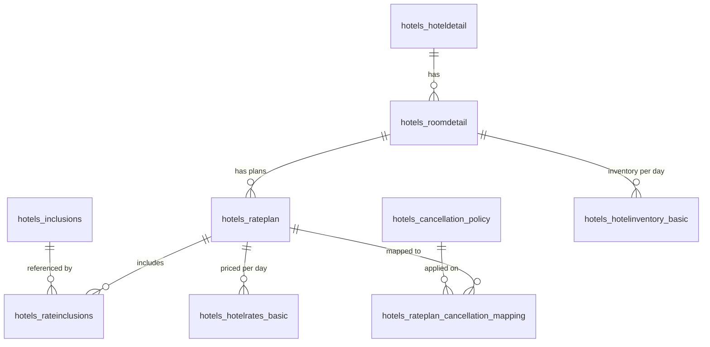
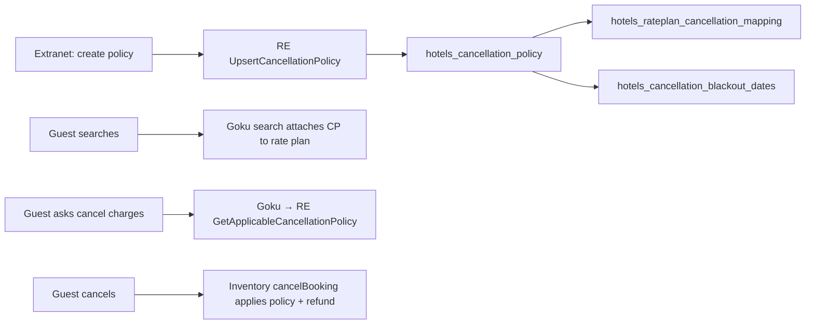
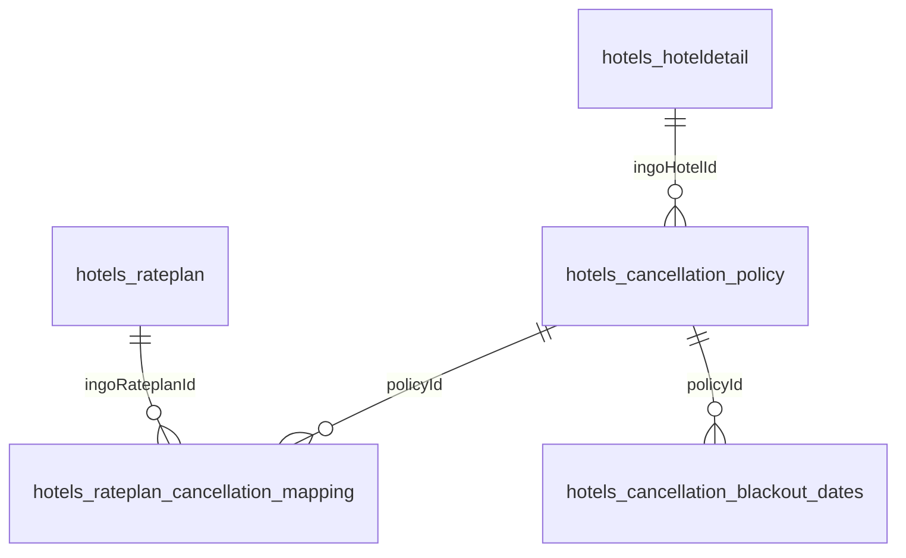
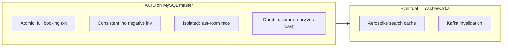
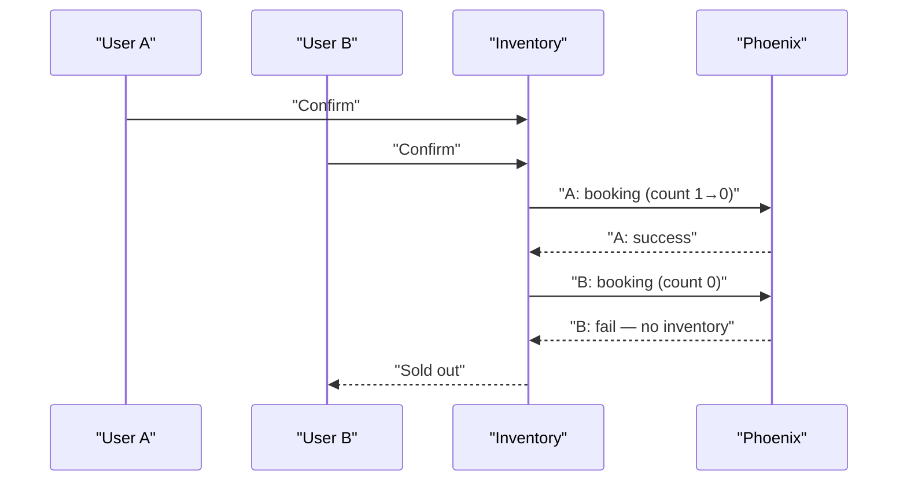
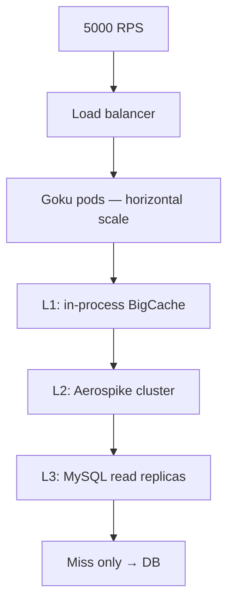
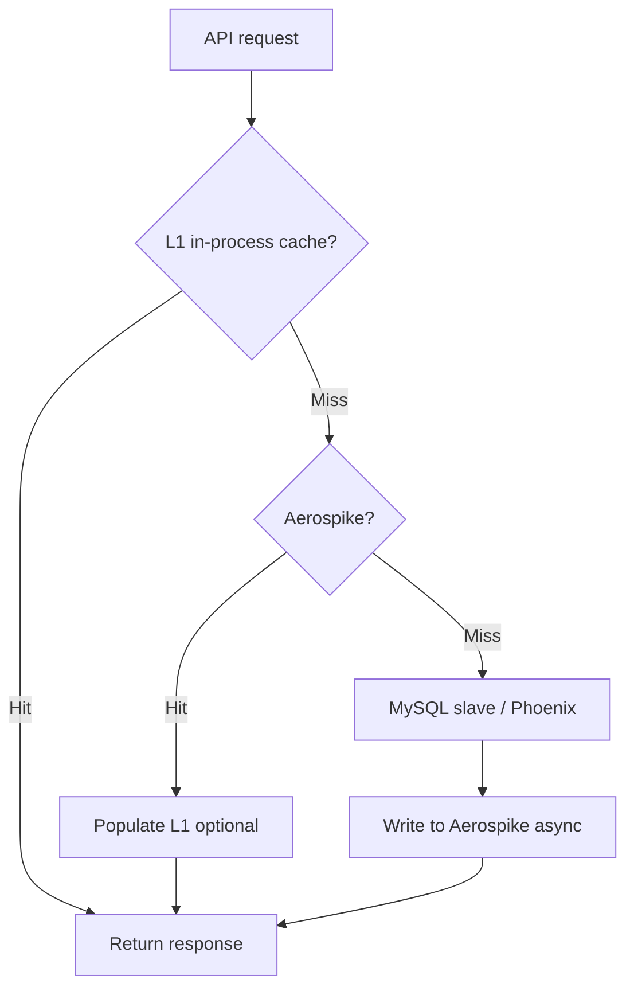
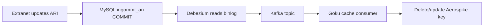
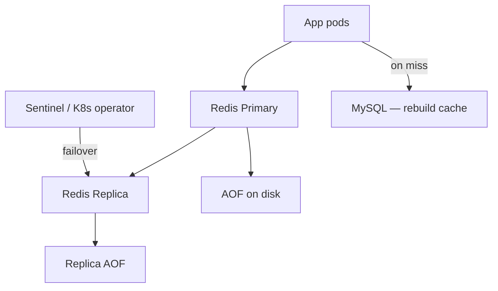
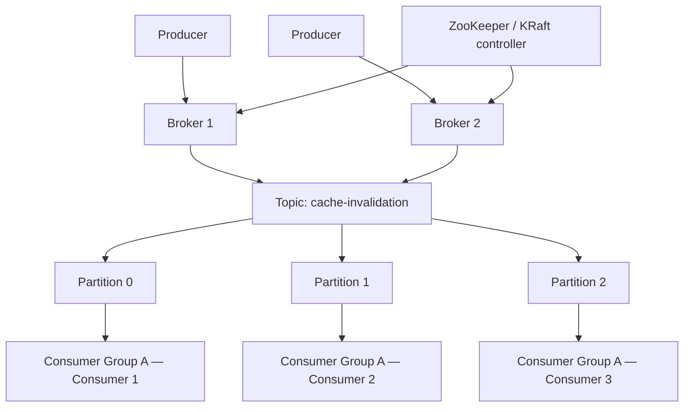

# Flexprice / MMT — Interview Q&A

Detailed answers for hotel supply, rate plans, cancellation policy, DB design, transactions, and MySQL indexing — based on **INGO / MMT** architecture.

← Related: [MMT System Design Q&A](../../Resume/MMT/System%20Design/Q&A.md) | [MicroServices](../../Resume/MMT/MicroServices/README.md)

---

## Table of contents

1. [Rate plans — breakfast, inclusions, cancellation — where stored?](#q1-rate-plans--breakfast-inclusions-cancellation--where-stored)
2. [Role of transaction / transactional update](#q2-role-of-transaction--transactional-update)
3. [Cancellation policy DB schema — build from scratch](#q3-cancellation-policy-db-schema--build-from-scratch)
4. [Rate plan ↔ room relationship — same plan on multiple rooms?](#q4-rate-plan--room-relationship--same-plan-on-multiple-rooms)
5. [Room 301 booked — do we maintain room numbers?](#q5-room-301-booked--do-we-maintain-room-numbers)
6. [Why MySQL? Where are transactions required? Messaging?](#q6-why-mysql-where-are-transactions-required-messaging)
7. [MySQL index types](#q7-mysql-index-types)
8. [Indexing algorithms](#q8-indexing-algorithms)
9. [Primary vs secondary index in B+ tree — what is stored?](#q9-primary-vs-secondary-index-in-b-tree--what-is-stored)
10. [ACID in hotel / cancellation terms](#q10-acid-in-hotel--cancellation-terms)
11. [Isolation levels](#q11-isolation-levels)
12. [Two requests updating same resource](#q12-two-requests-updating-same-resource)
13. [Scale 100 RPS → 5,000 RPS (sale day)](#q13-scale-100-rps--5000-rps-sale-day)
14. [Which DB for caching?](#q14-which-db-for-caching)
15. [Cache expiry + hot key / thundering herd](#q15-cache-expiry--hot-key--thundering-herd)
16. [Cache flow — reduce DB hits (where Kafka fits)](#q16-cache-flow--reduce-db-hits-where-kafka-fits)
17. [Redis durability — RAM data not lost](#q17-redis-durability--ram-data-not-lost)
18. [Redis crash — ideal approach](#q18-redis-crash--ideal-approach)
19. [RDB vs AOF — same disk vs two disks](#q19-rdb-vs-aof--same-disk-vs-two-disks)
20. [RDB or AOF — pick one and why](#q20-rdb-or-aof--pick-one-and-why)
21. [Kafka architecture components](#q21-kafka-architecture-components)
22. [Same partition, two consumers (same group)](#q22-same-partition-two-consumers-same-group)
23. [Same consumer, two partitions](#q23-same-consumer-two-partitions)

---

## Q1. Rate plans — breakfast, inclusions, cancellation — where stored?

### Interview scenario

> Same hotel offers:
> - Plan A: ₹3,000, **breakfast included**
> - Plan B: ₹3,000, **no breakfast**
> - Plan C: different **cancellation policy**

Each sellable option is a **rate plan** (product SKU), not just a room.

### Mental model

```text
Hotel
  └── Room Type (e.g. Deluxe Double — capacity 3, 10 physical rooms of this type)
        └── Rate Plan 1 (CP + free cancel + ₹3000 BAR)
        └── Rate Plan 2 (EP + non-refundable + ₹2800 BAR)
        └── Rate Plan 3 (MAP + flexible cancel + ₹3500 BAR)
```

### Database: `goibibo_inventory` (Content DB)

Most **static product definition** lives here.

#### Core tables

| Table | What it stores |
|-------|----------------|
| `hotels_hoteldetail` | Hotel master |
| `hotels_roomdetail` | **Room type** — name, occupancy, `noofrooms` (count of this type), amenities |
| `hotels_rateplan` | **Sellable plan** — meal, inclusions, payment mode, refund flag, link to room type |
| `hotels_inclusions` | Inclusion catalog (WiFi, spa credit, etc.) |
| `hotels_rateinclusions` | M2M: which inclusions attach to which rate plan |
| `hotels_hotelcancellationrule` | **Legacy** cancellation rules (generic FK to hotel/room/rateplan) |

#### `hotels_rateplan` — key columns (from `RatePlan` Django model)

| Column | Example / purpose |
|--------|---------------------|
| `roomtype_id` | FK → `hotels_roomdetail` — **which room type** this plan sells on |
| `rateplancode` | Unique SKU code (e.g. `45000000001_RP_01`) |
| `rateplanname` | Display name ("Breakfast Included - Flexible") |
| `mealplan` | `EP`, `CP`, `MAP`, `AP`, etc. |
| `nonrefundable` | Boolean — quick NR flag |
| `pay_at_hotel` / `payathotelflag` | PAN vs PAH |
| `inclusions` | M2M via `RateInclusions` |
| `contracttype` | B2C, corporate, etc. |
| `minnumofnights`, `max_los` | Stay rules |
| `sellcommission` | Commission % |
| `source_config_id` | Vendor/pricing model (INGO, Synxis, Derby) |

#### Meal plans (breakfast vs room-only)

From `hotelchoice.MEAL_PLAN_CHOICES`:

| Code | Meaning |
|------|---------|
| `EP` | Accommodation only (no meals) |
| `CP` | **FREE Breakfast** |
| `MAP` | Breakfast + lunch **or** dinner |
| `AP` | Breakfast + lunch + dinner |
| `AI` | All meals + custom inclusions |
| `TMAP`, `SMAP`, `LN`, `DN`, `LD` | Other meal combos |

**Same room type, different mealplan = different rate plan rows.**

Example:

```text
Room: Deluxe (roomtypecode = 45000000001)
  RatePlan A: mealplan=CP,  rateplancode=..., nonrefundable=false
  RatePlan B: mealplan=EP,  rateplancode=..., nonrefundable=true
```

#### Inclusions (beyond meal plan)

| Storage | Detail |
|---------|--------|
| `hotels_inclusions` | Master list — `inclusionname`, `displayname` |
| `hotels_rateinclusions` | Join table — active flag per rate plan |
| `hotels_services` | GenericRelation on rate plan for structured services |

Display logic merges `mealplan` + inclusion list when building search response (`get_inclusions_in_order()` in `rateplan.py`).

#### Prices (₹3,000 — dynamic per date)

**Not** in `hotels_rateplan`. Prices are in **ARI DB**:

| Database | Table | Purpose |
|----------|-------|---------|
| `ingommt_ari` | `hotels_hotelrates_basic` | Day-level BAR per rate plan |
| `ingommt_ari` | `hotels_hotelrates_extended/enriched` | Taxes, restrictions metadata |
| `ingommt_ari` | `hotels_hotelinventory_basic` | Availability count per room/rateplan/date |

**Phoenix** owns ARI writes. Goku reads at search time.

#### Cancellation policy (modern path)

| Database | Tables |
|----------|--------|
| RE / `goibibo_inventory` | `hotels_cancellation_policy` |
| | `hotels_rateplan_cancellation_mapping` |
| | `hotels_cancellation_blackout_dates` |

**Legacy path:** `hotels_hotelcancellationrule` — generic rules attached to rate plan via Django `content_type` + `object_id`.

#### Offers / promotions (₹3,000 → ₹2,700)

| Database | Tables |
|----------|--------|
| `hotelsupply_offers` / `goibibo_inventory` | `hotels_hoteloffercondition`, `hotels_hoteloffervalue` |

Applied at search by Goku + PriceEngine — not stored inside rate plan row.

### End-to-end storage map



### Interview one-liner

> "Rate plan = product SKU on a room type. Meal (`CP`/`EP`), inclusions, PAH/PAN, NR flag live on `hotels_rateplan` in content DB. Daily price and inventory live in `ingommt_ari` via Phoenix. Cancellation is mapped through RE policy tables."

---

## Q2. Role of transaction / transactional update

### What "transaction" means here (two meanings)

| Meaning | What it is at MMT |
|---------|-------------------|
| **A. DB transaction (ACID)** | `transaction.atomic()` — all-or-nothing DB writes |
| **B. Goku Trans Service** | Search diagram label for **transactional APIs** (availability, cancel quote) — not DB transaction |

Below covers **A** (what interview usually asks after "transactional database").

### Why transactional updates matter

Hotel booking = multiple writes that must succeed or fail **together**:

```text
Confirm booking (one logical operation):
  1. Update pro-booking row
  2. Insert confirmed booking row
  3. Update payment / VCC metadata
  4. (Maybe) partner booking id
  5. Kafka publish (often after commit)
```

If step 2 succeeds but step 1 rolled back manually → orphan data, double charge, wrong inventory.

### Where transactions are used in INGO

| Area | Mechanism | Example |
|------|-----------|---------|
| **Inventory confirm** | Django `transaction.atomic(using='booking-db-master')` | Booking modification: confirm new + cancel old atomically |
| **RE cancellation policy upsert** | Go `*sql.Tx` — single txn across policy + mapping + blackout rows | `UpsertCancellationPolicy` in RE |
| **Ancillary addon upsert** | Single MySQL transaction | Config + mapping rows in one commit |
| **Phoenix ARI update** | Transaction per batch rate/inventory update | Prevent partial calendar corruption |

**Inventory example** (`hotelbooking.py`):

```python
with transaction.atomic(using='booking-db-master'):
    bookingresponse, pbobj, bobj, rtb_obj = create_confirm_booking_object(...)
    if bobj:
        cancelBookingResponse = cancelBooking(booking_dict)  # modification flow
        if not cancelBookingResponse['success']:
            raise Exception(...)  # rolls back entire atomic block
```

**RE cancellation policy example** (`upsert_cp_service.go`):

```text
BeginTxn
  → INSERT/UPDATE hotels_cancellation_policy
  → INSERT/UPDATE hotels_rateplan_cancellation_mapping
  → INSERT/UPDATE hotels_cancellation_blackout_dates
Commit (or Rollback on any error)
```

### What is NOT always in one DB transaction

| Operation | Why split |
|-----------|-----------|
| **Inventory block in Phoenix** | Separate service (gRPC) — saga/compensating pattern |
| **Payment gateway charge** | External — confirm then rollback on fail |
| **Kafka publish** | Usually after DB commit — eventual consistency |
| **Aerospike cache update** | Async via Kafka consumer |

**Pattern:** **Local ACID** inside one DB + **saga** across Phoenix/payment/Kafka.

### Role of "transactional update" in interview answer

> "Transactional update ensures booking rows, policy mappings, and related metadata commit atomically on MySQL master. Cross-service steps (Phoenix inventory, payment) use compensating actions if later steps fail — not one global 2PC."

---

## Q3. Cancellation policy DB schema — build from scratch

### Journey overview



### If you were designing from zero

#### Step 1 — Policy definition table

```sql
CREATE TABLE hotels_cancellation_policy (
    id              BIGINT PRIMARY KEY AUTO_INCREMENT,
    code            VARCHAR(32) NOT NULL UNIQUE,      -- extranet-facing id
    ingoHotelId     VARCHAR(32) NOT NULL,
    policyName      VARCHAR(255) NOT NULL,            -- "Flexible", "Non-refundable"
    policyRuleCode  VARCHAR(64) NOT NULL,             -- encoded rules fingerprint / template id
    policyType      INT NOT NULL,                     -- STANDARD, GRACE, BLACKOUT, etc.
    vendor          INT DEFAULT 0,                    -- INGO, Synxis, etc.
    flagBits1       INT DEFAULT 0,                      -- feature flags
    isActive        TINYINT(1) DEFAULT 1,
    modifiedBy      INT,
    modifiedOn      TIMESTAMP,
    INDEX idx_hotel (ingoHotelId),
    INDEX idx_hotel_active (ingoHotelId, isActive)
);
```

**`policyRuleCode`:** Rules themselves (e.g. "free cancel until 24h before check-in, then 1 night charge") are encoded into `policyRuleCode` via `GeneratePolicyRuleCode()` from `PolicyRules` proto — not stored as 10 normalized rule rows in all paths. Template ID can also map to predefined rules.

**Actual rules at runtime** are deserialized from `policyRuleCode` / template + `policyType` in RE service layer.

#### Step 2 — Map policy to rate plans

One policy → many rate plans. One rate plan → typically one active policy per type.

```sql
CREATE TABLE hotels_rateplan_cancellation_mapping (
    id              BIGINT PRIMARY KEY AUTO_INCREMENT,
    policyId        BIGINT NOT NULL,                  -- FK → hotels_cancellation_policy.id
    ingoRateplanId  VARCHAR(32) NOT NULL,            -- FK → hotels_rateplan.rateplancode
    isActive        TINYINT(1) DEFAULT 1,
    modifiedBy      INT,
    INDEX idx_rateplan (ingoRateplanId),
    INDEX idx_policy (policyId),
    UNIQUE KEY uk_policy_rateplan (policyId, ingoRateplanId)
);
```

This answers: **"Deluxe + Breakfast plan has flexible cancel; Deluxe EP has non-refundable."**

#### Step 3 — Blackout dates (exceptions)

```sql
CREATE TABLE hotels_cancellation_blackout_dates (
    id                  BIGINT PRIMARY KEY AUTO_INCREMENT,
    policyId            BIGINT NOT NULL,
    dateRange           VARCHAR(64),                  -- e.g. "2025-12-24:2025-12-26"
    blackoutPolicyId    BIGINT,                       -- alternate policy during blackout
    isActive            TINYINT(1) DEFAULT 1,
    modifiedBy          INT,
    INDEX idx_policy (policyId)
);
```

New Year's Eve might use stricter rules without creating a whole new hotel policy.

#### Step 4 — Legacy table (still exists for older hotels)

```sql
-- hotels_hotelcancellationrule (generic FK pattern)
content_type_id  -- points to hoteldetail / rateplan / roomdetail
object_id
startday, endday          -- days before check-in window
chargestype, chargesvalue -- PERCENT / NIGHTS / FIXED
staystart, stayend        -- stay date validity
bookingdatestart, bookingdateend
```

Attached to `RatePlan` via Django `GenericRelation(HotelCancellationRule)`.

### APIs in the flow

| Step | API | Service |
|------|-----|---------|
| Create/edit policy | `UpsertCancellationPolicy` | RE (via CB → DO) |
| List policies | `GetCancellationPolicy` | RE |
| Search — show policy to user | Embedded in search response | Goku reads CP metadata |
| Quote cancel penalty | `GetApplicableCancellationPolicy` | RE (Goku calls at cancel quote) |
| Execute cancel | `cancelBooking()` | Inventory |

### ER diagram (modern path)



### Upsert transaction boundary

All three tables updated in **one MySQL transaction** in RE — no orphan mapping if policy insert fails.

---

## Q4. Rate plan ↔ room relationship — same plan on multiple rooms?

### Short answer

- **Rate plan belongs to ONE room type** (`roomtype_id` FK).
- **Same rate plan is NOT shared across multiple room types** — you **clone/create per room type** if needed.
- **Multiple rate plans can exist on the same room type** (breakfast vs no breakfast).

### Schema relationship

```text
hotels_roomdetail (1)  ──<  (N) hotels_rateplan
     roomtypecode              rateplancode
     max_guest_occupancy=3     mealplan=CP
     noofrooms=10              nonrefundable=false
```

### "Room 1, Room 2, Room 3" vs room type

| Concept | What it is | Stored as |
|---------|------------|-----------|
| **Room type** | Category — "Deluxe Double", sleeps 3 | `hotels_roomdetail` row |
| **Physical room** | Room 301, 302, 303 | **Usually NOT in INGO core booking** |
| **Inventory count** | 10 deluxe rooms available tonight | `hotels_hotelinventory_basic.count = 10` |
| **Capacity** | Max 3 guests | `max_adult_occupancy`, `max_guest_occupancy` |

**Room ID in API ≠ hotel room number 301.**

`roomtypecode` is a system code like `45000000001` — identifies **category**, not "room 1 of 3".

### Same rate plan on "multiple rooms" — two interpretations

| Interpretation | Correct? |
|----------------|----------|
| Same plan on Deluxe **and** Suite | **No** — separate rate plan per room type (or duplicate config) |
| Same plan sells 10 deluxe units tonight | **Yes** — inventory count = 10, not 10 rows |
| Room 1/2/3 as in 3 identical deluxe rooms | **Count-based** — `noofrooms=3` on room detail |

### Rates per date

`hotels_hotelrates_basic` keyed by **rate plan code + date** — one price applies to all units of that room type under that plan.

### Interview answer

> "Rate plan has FK to one room type. Breakfast vs no-breakfast = two rate plan rows on same room type. Physical room numbers are not the inventory key — we sell by room type + count. Capacity 3 is on room detail, not per physical room."

---

## Q5. Room 301 booked — do we maintain room numbers?

### Short answer

**INGO/MMT core OTA stack generally does NOT assign physical room 301 at booking time.**

| What system tracks | What hotel PMS tracks |
|--------------------|------------------------|
| "1 Deluxe room booked Dec 25–27" | "Room 301 assigned to Mr. Sharma" |
| Inventory count decremented by 1 | Room-level housekeeping status |

### How hotel knows something is booked

1. **Booking row** — `hotels_hotelbooking` with `roomtype_id`, dates, guest, `confirmbookingid`
2. **Inventory count** — Phoenix reduces available count for that room type + dates
3. **Extranet / PMS sync** — Nexus-Partner pushes booking to Synxis/Derby; **hotel assigns room number at check-in**

### Fields on booking (conceptual)

| Field | Purpose |
|-------|---------|
| `roomtype` / `roomtypecode` | Category booked |
| `noofrooms` | How many units |
| `checkin`, `checkout` | Stay window |
| **No `room_number=301`** in standard flow | Assignment is operational |

### When room numbers appear

- Partner PMS integration may return `pmsId` / room assignment in `bookingMetaData` from Nexus
- Web check-in flows may collect preferences — not core inventory key
- Housekeeping systems are hotel-side

### Interview answer

> "We book a room **type** and decrement **count**. Room 301 is a PMS concept — hotel assigns specific physical room at check-in or via channel manager push. Our schema is count-based inventory, not room-number-based."

---

## Q6. Why MySQL? Where are transactions required? Messaging?

### Why MySQL (not only Redis/Mongo)

| Requirement | Why MySQL |
|-------------|-----------|
| **ACID transactions** | Booking + policy mapping must be atomic |
| **Relational model** | Hotel → room → rate plan → policy mappings are naturally relational |
| **Mature replication** | Master + 5 read replicas — proven ops |
| **Strong consistency on writes** | Money and inventory state |
| **Existing ecosystem** | Django ORM (Inventory), Go DAOs (RE, Phoenix) |

Redis/Aerospike used for **cache**, not source of truth for bookings.

### Distributed topology (not single node)

```text
                    ┌─────────────┐
   Writes ─────────► │ MySQL Master│
                    └──────┬──────┘
                           │ async replication
         ┌─────────────────┼─────────────────┐
         ▼                 ▼                 ▼
    Replica 1         Replica 2  ...    Replica 5

   Goku search ──► Aerospike ──► (miss) ──► Replica
   Confirm book ──► Master (booking-db-master)
```

### Where transactions are **required**

| Flow | Must be atomic |
|------|----------------|
| Confirm booking + update pro-booking | Yes — same booking DB txn |
| Booking modification (new confirm + old cancel) | Yes — `transaction.atomic` |
| Upsert cancellation policy + rate plan mappings + blackouts | Yes — RE `sql.Tx` |
| Addon config upsert (multi-table state-diff) | Yes — Ancillary txn |
| Phoenix batch rate update for date range | Yes — avoid half-updated calendar |
| **Search** | No txn needed — read only |
| **Kafka publish** | After commit — not in same txn as external broker |

### Messaging used alongside DB

| System | Use |
|--------|-----|
| **Kafka** | Cache invalidation (Debezium CDC), booking sync to RE, events |
| **Celery** | Inventory hold TTL (`revive_inventory_pro_booking`) |
| **Redis** | Sessions, payment cache, modification flow cache |

**Flow with queue (after DB commit):**

```text
Write booking to MySQL master → COMMIT → publish Kafka event → RE consumer updates read model
```

**Dual-write problem:** If pod crashes after DB but before Kafka — RE may lag. Mitigated by **Debezium CDC** (read binlog) or **outbox pattern**.

### Interview answer

> "MySQL master for writes because booking and policy mappings need ACID. Replicas for read-heavy search via cache. Transactions on confirm booking and policy upsert. Kafka for async fan-out after commit — not a replacement for transactional DB."

---

## Q7. MySQL index types

MySQL (InnoDB) supports these **index types**:

| Index type | Syntax | Use case |
|------------|--------|----------|
| **PRIMARY KEY** | `PRIMARY KEY` | Clustered index — one per table |
| **UNIQUE** | `UNIQUE INDEX` | Enforce uniqueness (`rateplancode`, `roomtypecode`) |
| **INDEX / KEY** | `INDEX idx_name (col)` | General lookup acceleration |
| **FULLTEXT** | `FULLTEXT(col)` | Text search (hotel names, descriptions) — MyISAM/InnoDB (with limits) |
| **SPATIAL** | `SPATIAL INDEX` | Geo data |

### Constraint-backed indexes

| Constraint | Creates |
|------------|---------|
| `PRIMARY KEY` | Clustered B+ tree |
| `UNIQUE` | Unique B+ tree |
| `FOREIGN KEY` | Index on referencing column (InnoDB) |

### Composite / covering indexes

```sql
INDEX idx_hotel_active (ingoHotelId, isActive)
INDEX idx_rateplan_date (rateplancode, staydate)
```

Order matters — leftmost prefix rule for composite indexes.

### Examples from MMT schema

| Table | Indexed columns |
|-------|-----------------|
| `hotels_rateplan` | `roomtype_id`, `rateplancode`, `mealplan`, `createdon` |
| `hotels_roomdetail` | `hotel_id`, `roomtypecode`, `roomtype` |
| `hotels_cancellation_policy` | `ingoHotelId` |
| `hotels_hotelprobooking` | hotel + dates (for `GetProbookings`) |

### Interview answer

> "InnoDB: PRIMARY (clustered), UNIQUE, secondary INDEX, FULLTEXT, SPATIAL. We use composite indexes on hotelId+isActive for policy list, unique on rateplancode."

---

## Q8. Different indexing algorithms

| Algorithm | Engine | Used for |
|-----------|--------|----------|
| **B+ Tree** | InnoDB (default) | PRIMARY KEY, UNIQUE, INDEX — range queries, sorting |
| **Hash** | MEMORY engine only | Exact match — not default InnoDB |
| **FULLTEXT** | InnoDB/MyISAM | Tokenized text search — inverted index |
| **R-Tree** | MyISAM/InnoDB spatial | SPATIAL indexes — geo |

### B+ Tree (what InnoDB uses)

- Balanced tree — all leaves at same depth
- **Leaf nodes linked** — efficient range scans (`WHERE checkin BETWEEN ...`)
- **O(log n)** lookup

### Hash index

- O(1) exact match
- No range queries
- InnoDB adaptive hash index (internal optimization) — not user-defined for most tables

### FULLTEXT

- Inverted index: word → row IDs
- `MATCH(col) AGAINST('breakfast')`

### When to mention in interview

> "InnoDB secondary indexes are B+ trees. Range queries on dates (ARI calendar, stay dates) fit B+ tree well. Hash would be poor for date ranges. FULLTEXT only if searching description text."

---

## Q9. Primary vs secondary index in B+ tree — what is stored?

### InnoDB clustered index (PRIMARY KEY)

- **Leaf pages store full row data** — all columns of the table
- Table data **is** the clustered index — physically ordered by PK
- One clustered index per table

```text
PRIMARY KEY (id=101) →  [leaf: full row — name, mealplan, hotel_id, ...]
```

### Secondary index (INDEX, UNIQUE non-clustered)

- Leaf pages store **index column(s) + PRIMARY KEY value**
- **Not** full row — pointer to clustered index

```text
INDEX (roomtype_id=55) →  [leaf: roomtype_id=55, PK=101]
                              [leaf: roomtype_id=55, PK=205]
```

Lookup = **index scan** + **回表 (bookmark lookup)** → follow PK to clustered index to get full row.

### Example: find rate plans for room type

```sql
SELECT * FROM hotels_rateplan WHERE roomtype_id = 45000000001;
```

1. Scan secondary index on `roomtype_id`
2. Collect PKs: 101, 205, 309
3. For each PK — lookup clustered index for full row (`mealplan`, `rateplancode`, etc.)

### Covering index (optimization)

If index contains all columns needed:

```sql
SELECT rateplancode, mealplan FROM hotels_rateplan WHERE roomtype_id = ?;
```

If `INDEX (roomtype_id, rateplancode, mealplan)` exists → **covering index** — no回表, faster.

### Visual comparison

```text
CLUSTERED (PK id):
  Leaf: [id=101 | all columns............]

SECONDARY (roomtype_id):
  Leaf: [roomtype_id=55 | id=101]
  Leaf: [roomtype_id=55 | id=205]
        └──► lookup PK 101 in clustered tree for full row
```

### Interview answer

> "InnoDB primary key is clustered — leaf has full row. Secondary index leaves store indexed columns plus primary key — need second lookup for other columns unless covering index. Rate plan lookups by roomtype_id use secondary index then回表 to get mealplan and cancellation flags."

---

## Q10. ACID in hotel / cancellation terms

Map each ACID property to **real hotel/booking operations** — not textbook-only.

### A — Atomicity (all or nothing)

**Meaning:** Partial updates must not leave system in broken state.

| Hotel example | What must be atomic |
|---------------|---------------------|
| **Confirm booking** | Pro-booking update + confirmed booking insert + payment metadata — together or rollback |
| **Upsert cancellation policy** | Policy row + rate plan mappings + blackout dates — one RE transaction |
| **Booking modification** | Confirm new booking + cancel old booking — `transaction.atomic` in Inventory |
| **Cancel booking** | Status update + inventory revert — must not cancel without releasing inventory (compensate if fail) |

**Failure without atomicity:** Guest charged but no booking row. Policy mapped to rate plan but policy row missing.

### C — Consistency (valid state before and after)

**Meaning:** DB constraints and business rules always hold.

| Hotel example | Consistency rule |
|---------------|------------------|
| Inventory count | Never negative available rooms (Phoenix validation) |
| Unique `rateplancode` | No duplicate sellable SKUs |
| Cancellation mapping | `ingoRateplanId` must belong to same `ingoHotelId` as policy |
| Booking | Cannot confirm same pro-booking twice with two confirm IDs |

Consistency = **constraints + application validators** inside transaction.

### I — Isolation (concurrent requests don't corrupt each other)

**Meaning:** Parallel bookings/updates behave as if serialized (level-dependent).

| Hotel example | Race |
|---------------|------|
| Two guests book last room | Both see availability=1 — only one must win |
| Extranet updates rate while guest reviews | Review must not show stale price after update (bounded lag OK on search) |
| Two ops edit same cancellation policy | Last write or lock — no torn mapping rows |

See [Q11](#q11-isolation-levels) and [Q12](#q12-two-requests-updating-same-resource).

### D — Durability (committed = survives crash)

**Meaning:** After COMMIT, data survives DB restart.

| Hotel example | Why it matters |
|---------------|----------------|
| Confirmed booking on master | Must survive MySQL crash — guest has payment proof |
| Cancellation policy commit | Hotel legal/refund rules must not vanish |
| **Cache (Redis/Aerospike)** | **Not** durability for source of truth — MySQL/Phoenix is |

**Interview line:** "ACID on MySQL for bookings and policies. Cache is performance layer — durable truth stays on master DB."



---

## Q11. Isolation levels

MySQL InnoDB supports SQL isolation levels. **Default: REPEATABLE READ (RR).**

| Level | What you see | Dirty read | Non-repeatable read | Phantom read |
|-------|--------------|------------|---------------------|--------------|
| **READ UNCOMMITTED** | Uncommitted data of others | Possible | Possible | Possible |
| **READ COMMITTED (RC)** | Only committed data | No | Possible | Possible |
| **REPEATABLE READ (RR)** | Same snapshot in one txn | No | No | Mostly no (InnoDB) |
| **SERIALIZABLE** | Full lock — serial execution | No | No | No |

### Plain English

| Level | Hotel analogy |
|-------|---------------|
| **READ UNCOMMITTED** | Read another txn's half-written booking — almost never used |
| **READ COMMITTED** | Each query sees latest commit — good for short reads |
| **REPEATABLE READ** | Same transaction sees same inventory snapshot — default InnoDB |
| **SERIALIZABLE** | One booking at a time — safe but slow |

### InnoDB nuance

- **RR + MVCC:** Reads use snapshot; writes use row locks.
- **Next-key locks** in RR reduce phantom rows on range scans.
- **Gap locks** help prevent double-book last room in some patterns — but app-level checks still needed.

### What MMT-style systems typically use

| Path | Typical isolation |
|------|-------------------|
| Search/read (slave) | RC or RR read snapshot — stale OK |
| Confirm booking (master) | RR + `SELECT ... FOR UPDATE` on critical rows where needed |
| Policy upsert | RR in single txn |

### Interview answer

> "InnoDB default REPEATABLE READ gives snapshot reads within a transaction. For last-room booking we still use row-level locks or optimistic versioning on inventory — isolation level alone isn't enough."

---

## Q12. Two requests updating same resource

**Scenario:** Two users or two API calls update **same hotel inventory**, **same booking**, or **same policy** at once.

### Strategies

| Strategy | How | MMT / hotel use |
|----------|-----|-----------------|
| **Pessimistic locking** | `SELECT ... FOR UPDATE` — second txn waits | Last inventory unit, confirm booking |
| **Optimistic locking** | Version column — `UPDATE ... WHERE id=? AND version=?` — fail if changed | Policy edit, config upsert |
| **Atomic DB operation** | `UPDATE inventory SET count = count - 1 WHERE count > 0` | Phoenix inventory decrement |
| **Distributed lock** | Redis lock per hotel+date+room | Rare — short hold during bulk update |
| **Idempotency key** | Same confirm retried — same result | Payment webhook retries |
| **Queue per resource** | Partition Kafka by `hotelId` — serial per hotel | Order events per property |

### Last room — two concurrent bookings



**Phoenix** rejects second decrement. Inventory sets `failurestatus = no_inventory`.

### Two extranet users edit same cancellation policy

- RE upsert in **one transaction** per request
- Second writer may overwrite if no version check — production may use `modifiedOn` check or optimistic lock
- Audit history tracks changes

### Interview answer

> "Reads scale on cache. Writes on same resource: pessimistic row lock or atomic conditional update for inventory; optimistic versioning for config; idempotency for payment retries."

---

## Q13. Scale 100 RPS → 5,000 RPS (sale day)

**Scenario:** Verification / review API at **100 RPS** today. Sale tomorrow → **5,000 RPS** expected.

### Step-by-step scaling plan



| Layer | Action |
|-------|--------|
| **1. Measure** | p99 latency, cache hit ratio, DB QPS, CPU per pod |
| **2. Cache first** | Push hit rate from 90% → 98% — 50x fewer DB hits |
| **3. Horizontal scale** | More Goku pods behind LB (stateless) |
| **4. Aerospike** | Scale cluster nodes; NVMe for hot sets |
| **5. DB** | Read replicas for cache miss path; never scale master for search reads |
| **6. Pre-warm** | Before sale: warm top hotel keys in Aerospike |
| **7. Rate limit** | Per-client throttle — protect origin |
| **8. Degrade gracefully** | Return cached stale with short TTL vs hard fail |
| **9. Async path** | Non-critical work (analytics) off hot path |

### Math intuition

| Hit rate | DB QPS at 5000 RPS |
|----------|---------------------|
| 90% | 500 DB QPS |
| 98% | 100 DB QPS |
| 99.5% | 25 DB QPS |

**Cache is the main lever** for read-heavy verification/search APIs.

### MMT-specific

- Goku `FetchQueryData` — Aerospike → MySQL fallback
- Separate pools: `citysearch`, `review`
- Kafka invalidation — don't thundering-herd DB on every rate change during sale

### Interview answer

> "50x traffic on read API: stateless pod autoscale + Aerospike cache-aside + pre-warm hot hotels + replica reads on miss. Master DB untouched. Monitor hit ratio and p99."

---

## Q14. Which DB for caching?

**Not one size — MMT uses tiered cache by data shape.**

| Tier | Technology | Best for | MMT usage |
|------|------------|----------|-----------|
| **L1 — in-process** | BigCache, GoCache | Tiny hot config, per-pod | Auth tokens, local flags |
| **L2 — distributed KV** | **Redis Cluster** | Sessions, small objects, locks, short TTL | Payment cache, sessions, modification flow cache |
| **L3 — high-throughput KV** | **Aerospike** | Large search payloads, millions of keys, SSD | Hotel, room, rateplan, offers — **primary search cache** |
| **NOT for cache** | MySQL | Source of truth only | Content + booking master |
| **NOT for hot search** | Mongo alone | — | MMT stack is MySQL + Aerospike |

### Why Aerospike for search cache (vs Redis alone)

| Factor | Aerospike | Redis |
|--------|-----------|-------|
| Payload size | Large hotel+room+rate blobs | Better for small KV |
| Throughput at scale | Built for millions TPS reads | Can hit memory/network limits |
| TTL per set | Per-set TTL config | Per-key TTL |
| Persistence | Optional — still cache not SoT | RDB/AOF — see Q17 |

### Why Redis still used

- Session storage
- Payment / provisional modification keys
- Distributed coordination
- Smaller shared objects across Inventory Python stack

### Interview answer

> "Aerospike for heavy search read cache. Redis for sessions and payment-adjacent small state. MySQL remains source of truth. In-process cache for per-pod hot keys."

---

## Q15. Cache expiry + hot key / thundering herd

Two related problems:

### Problem 1 — Cache TTL expires (thundering herd)

**What happens:**

```text
Popular hotel key TTL expires at T=0
5000 requests at T=0.001 → all CACHE MISS
5000 concurrent DB queries for SAME hotel → DB meltdown
```

**This is thundering herd / cache stampede.**

### Solutions

| Technique | How |
|-----------|-----|
| **Jitter on TTL** | Expire at random `TTL ± 10%` — spread misses |
| **Stale-while-revalidate** | Return stale value immediately; one background refresh |
| **Single-flight / request coalescing** | Only **one** goroutine refreshes key; others wait on same promise |
| **Probabilistic early refresh** | Refresh in background before expiry if key is hot |
| **Mutex per key** | `sync.Map` of locks per `hotelId` in app layer |
| **Never expire hot keys** | Active refresh via Kafka — TTL very long on top sellers |

### Problem 2 — Hot key (always hot, not just expiry)

**Example:** Goa sale — one hotel gets 40% of traffic. Single Aerospike key becomes bottleneck.

| Technique | How |
|-----------|-----|
| **Local L1 cache** | Each pod caches hot key in BigCache — 5s TTL |
| **Key replication** | `hotel:123:v1`, `hotel:123:v2` — random read shard |
| **Read replicas** | Aerospike cluster scales reads across nodes |
| **Rate limit per key** | Cap QPS to origin for one hotel |

### MMT sale-day combo

```text
Before sale: pre-warm Aerospike for top N hotels
During sale:  L1 + Aerospike + single-flight on miss
On rate change: Kafka invalidation (priority topic) — not sync DB per search
TTL: jitter + long TTL on static hotel metadata
```

### Interview answer

> "Expiry stampede: jitter TTL + single-flight refresh + stale-while-revalidate. Hot key: local L1 + Aerospike cluster + pre-warm before sale. Kafka invalidates — doesn't sit in read path."

---

## Q16. Cache flow — reduce DB hits (where Kafka fits)

**Clarifying the confusion:** Read path is **not** `request → Kafka → DB`. Kafka is for **invalidation after writes**, not for reads.

### Read path (every search / verify request)



**Goal:** 95%+ requests never touch MySQL.

### Write path (extranet updates rate)



**Kafka role:** Tell all Goku pods "this hotel's cache is stale" — **after** DB already has truth.

### Why not write Kafka before DB?

| Order | Problem |
|-------|---------|
| Kafka first, DB crash | Consumers invalidate cache → DB never updated → bad reads |
| **DB first, then Kafka/CDC** | Correct — DB is truth; cache catches up |

**Outbox pattern:** Insert `outbox_events` in **same txn** as booking row; poller publishes to Kafka — fixes pod-crash-between-DB-and-Kafka.

### Ensuring many parallel queries hit cache not DB

| Mechanism | Effect |
|-----------|--------|
| Cache-aside on hit | Aerospike returns in &lt;1ms — DB never called |
| Single-flight on miss | 1000 parallel misses → 1 DB query |
| Connection pool limit | Caps DB damage if cache fails |
| Read replica | Miss path doesn't hit master |
| Monitoring | Alert when cache hit ratio drops |

### Interview answer

> "Read: L1 → Aerospike → DB on miss only. Kafka not in read path. Write: DB commit → CDC/Kafka → cache delete. Outbox if app publishes events. Parallel requests coalesce on cache miss."

---

## Q17. Redis durability — RAM data not lost

**Truth:** Redis is **in-memory first**. Durability is **optional** and **weaker than MySQL**.

### What Redis provides

| Feature | Purpose |
|---------|---------|
| **RDB snapshots** | Point-in-time dump to disk |
| **AOF (Append Only File)** | Log every write command |
| **AOF fsync modes** | `always` / `everysec` / `no` — durability vs speed |
| **Replication** | Primary → replica in memory (+ disk if persistence on) |
| **Redis Sentinel** | Failover if primary dies |
| **Redis Cluster** | Sharding + replication |

### What we cache in Redis at MMT (safe to lose?)

| Data | Lose on crash? |
|------|----------------|
| Session | User re-login — acceptable |
| Payment modification cache | Retry flow — must have TTL + DB truth |
| Search hotel blobs | **Should be in Aerospike** — rebuild from MySQL |

**Rule:** Never store **only** copy of booking/payment state in Redis.

### Safety measures

| Measure | Detail |
|---------|--------|
| **Replication** | Replica on another node — primary crash → promote replica |
| **Persistence** | AOF everysec + RDB hourly — tradeoff |
| **TTL on all cache keys** | Self-healing after crash |
| **Source of truth in MySQL** | Redis rebuilds on miss |
| **Cluster mode** | No single point of failure |

### Interview answer

> "Redis RAM is cache/session — MySQL holds truth. Replication + AOF everysec for session recovery. Booking never Redis-only."

---

## Q18. Redis crash — ideal approach

**Scenario:** Redis primary crashes mid-sale.

### Correct recovery architecture



### Step-by-step on crash

1. **Sentinel** detects primary down (or K8s restarts pod)
2. **Promote replica** to primary — sub-second to few seconds
3. Apps reconnect — brief cache miss spike
4. **Cache-aside:** misses go to MySQL/Aerospike — fill Redis again
5. **No data loss** for persisted AOF/replica — **some loss** possible with `everysec` (last 1s writes)

### Ideal config (interview)

| Setting | Value | Why |
|---------|-------|-----|
| Replication | 1+ replica | HA |
| AOF | `appendonly yes`, `appendfsync everysec` | Balance durability/perf |
| RDB | Periodic snapshot | Faster restarts |
| Workload | Cache-only keys have TTL | Self-heal |
| Critical path | Don't depend on Redis for booking commit | MySQL master |

### If Redis is **pure cache** (no session requirement)

**Simplest correct approach:** Accept empty cache on crash → **thundering herd** → use **single-flight** + **rate limit DB** until cache refills.

---

## Q19. RDB vs AOF — same disk vs two disks

### RDB (snapshot)

- Fork + write compressed snapshot file (`dump.rdb`)
- **Point-in-time** — lose data since last snapshot
- Fast restarts — load one file

### AOF (append log)

- Every write appended to log file
- `rewrite` compacts log periodically
- More durable — replay commands on startup

### Same disk vs different disks

| Setup | Meaning |
|-------|---------|
| **RDB + AOF same disk as Redis** | Cheaper; disk failure kills Redis + backups together |
| **AOF on same machine, replica on another** | Primary crash → replica promoted — **most common HA** |
| **Backups to S3/EBS snapshot different AZ** | Disaster recovery |

**Why two disks / two nodes?**

> Not duplicate data for fun — **correlated failure protection**. Primary disk corrupt → replica on different node still has copy.

### Interview answer

> "Replication across nodes is primary HA. RDB+AOF on primary for restart speed. Backups off-box for disaster. Same-disk RDB+AOF only protects process crash, not disk death."

---

## Q20. RDB or AOF — pick one and why?

| Pick | When |
|------|------|
| **AOF (`everysec`)** | **Default recommendation** for session + need low data loss |
| **RDB only** | Pure cache, OK to lose minutes, fast restart |
| **Both** | Production Redis — AOF for durability, RDB for compact backup |
| **Neither** | Pure cache, MySQL rebuilds everything — **valid if HA + cache-aside** |

### For MMT-style Redis (sessions + payment cache)

**Choose: AOF everysec + replication + both RDB periodic**

**Why AOF over RDB alone:** Lose at most ~1 second of writes vs minutes with RDB-only.

**Why not AOF always:** `fsync always` — too slow for high write QPS.

### If forced to pick **only one**

> **AOF with everysec** — better durability story for interview. Mention cache can rebuild from MySQL anyway.

---

## Q21. Kafka architecture components



| Component | Role |
|-----------|------|
| **Producer** | Publishes events (or Debezium CDC acts as producer) |
| **Broker** | Stores partitions on disk |
| **Topic** | Named stream (e.g. `normal_cache_raw_events`) |
| **Partition** | Ordered log shard — unit of parallelism |
| **Offset** | Position in partition — consumer tracks |
| **Consumer** | Reads messages |
| **Consumer Group** | Cooperative consumers — each partition → one consumer in group |
| **ZooKeeper / KRaft** | Cluster metadata, leader election |

### MMT examples

| Topic purpose | Producer | Consumer |
|---------------|----------|----------|
| ARI cache bust | Debezium | Goku async cache updater |
| Booking sync | Inventory | RE migration consumer |
| Sold-out events | Inventory | Goku priority consumer |

### Key properties

| Property | Meaning |
|----------|---------|
| **Ordering** | Guaranteed **within partition** only |
| **Retention** | Messages kept N days — replay possible |
| **At-least-once** | Consumer commits offset after process — may duplicate |
| **Partition key** | `hotelId` — all events for one hotel ordered |

---

## Q22. Same partition, two consumers (same group)

**Question:** Can one partition be read by **two consumers in the same consumer group**?

**Answer: NO.**

### Rule

```text
One partition  →  at most ONE consumer per consumer group
One consumer   →  can read MANY partitions
```

**Why:** Offsets are per `(group, partition)`. Two consumers same group same partition → duplicate processing + offset chaos.

### If you need two readers of same data

| Approach | How |
|----------|-----|
| **Two consumer groups** | Group A and Group B each get full copy — e.g. cache updater + analytics |
| **More partitions** | Scale consumers horizontally |

### Example — MMT cache invalidation

```text
Topic: cache_events, 12 partitions, Consumer Group: goku-cache-updater, 12 consumers
  → Each consumer owns 1 partition
  → 12x parallel cache deletes
```

### Rebalance

Consumer dies → **rebalance** — its partitions assigned to surviving consumers.

---

## Q23. Same consumer, two partitions

**Question:** Can **one consumer** read **two partitions**?

**Answer: YES.**

### Rule

```text
Consumer 1 in group can own: Partition 0 + Partition 3 + Partition 7
```

Happens when:

- **Fewer consumers than partitions** — one consumer takes multiple
- **Uneven partition assignment** — 10 partitions, 3 consumers → 4+3+3 split

### Example

| Partitions | Consumers in group | Assignment |
|------------|-------------------|------------|
| 6 | 6 | 1:1 |
| 6 | 3 | each consumer gets 2 partitions |
| 6 | 10 | 6 active, 4 idle |

### Ordering caveat

**No ordering guarantee across partitions.** Hotel A events on P0 and hotel B on P1 — processed in parallel. Use **same partition key** (`hotelId`) when order matters per hotel.

### Interview answer

> "Same group: one partition one consumer. One consumer many partitions — yes, when consumers < partitions. Different groups: both can read all partitions independently."

---

## Quick revision cheat sheet

| Question | One-line answer |
|----------|-----------------|
| Breakfast vs no breakfast? | Two `hotels_rateplan` rows, different `mealplan` (`CP` vs `EP`) |
| Where is ₹3000? | `hotels_hotelrates_basic` in `ingommt_ari` per date |
| Cancellation per plan? | `hotels_cancellation_policy` + `hotels_rateplan_cancellation_mapping` |
| Transaction role? | Atomic booking rows + policy mappings; saga for Phoenix/payment |
| Rate plan ↔ room? | N rate plans → 1 room type; not shared across types |
| Room 301? | Count-based inventory; PMS assigns physical room |
| Why MySQL? | ACID + relations + replication |
| Replica lag? | Search eventual; confirm uses master/strong validation |
| Index types? | PRIMARY, UNIQUE, INDEX, FULLTEXT, SPATIAL |
| PK vs secondary? | PK leaf = full row; secondary leaf = cols + PK pointer |
| ACID hotel terms? | Atomic confirm; consistent inv≥0; isolated last-room; durable on master |
| Isolation levels? | InnoDB default RR; SERIALIZABLE for strict serial |
| Same resource 2 writes? | Row lock / atomic decrement / optimistic version |
| 100→5000 RPS? | Scale pods + Aerospike hit rate + pre-warm |
| Cache DB? | Aerospike search; Redis session; MySQL SoT |
| Hot key / TTL expiry? | Jitter + single-flight + L1 + pre-warm |
| Kafka in read path? | No — invalidation after DB write via CDC |
| Redis durability? | Replication + AOF; MySQL is truth |
| RDB vs AOF? | AOF everysec if pick one; both in prod |
| Partition 2 consumers same group? | **No** |
| 1 consumer 2 partitions? | **Yes** |

---

## Related docs

| Doc | Path |
|-----|------|
| Cancellation policy flow | `Resume/MMT/CancellationPolicy/GetCancellationPolicy.md` |
| MicroServices — Goku, Phoenix, RE | `Resume/MMT/MicroServices/` |
| System design Q&A (payment, TTL, Kafka) | `Resume/MMT/System Design/Q&A.md` |
| Inventory blocking | `Resume/MMT/System Design/04-inventory-blocking-lld.md` |
