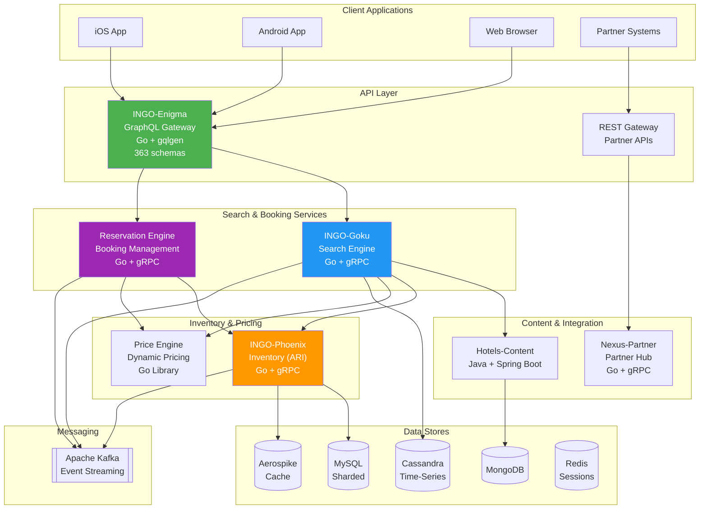
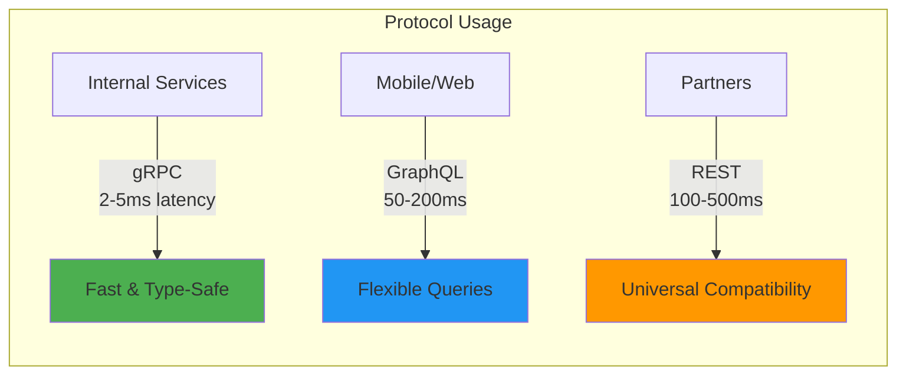
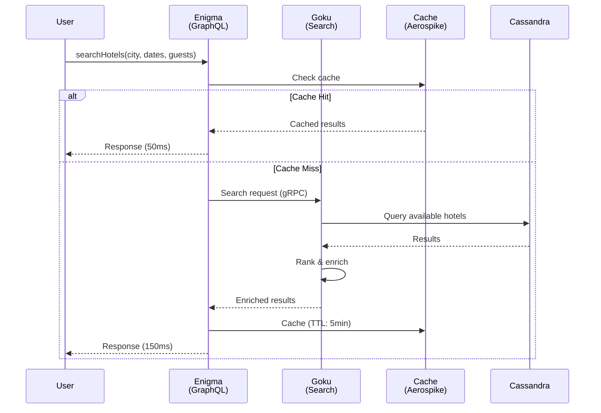
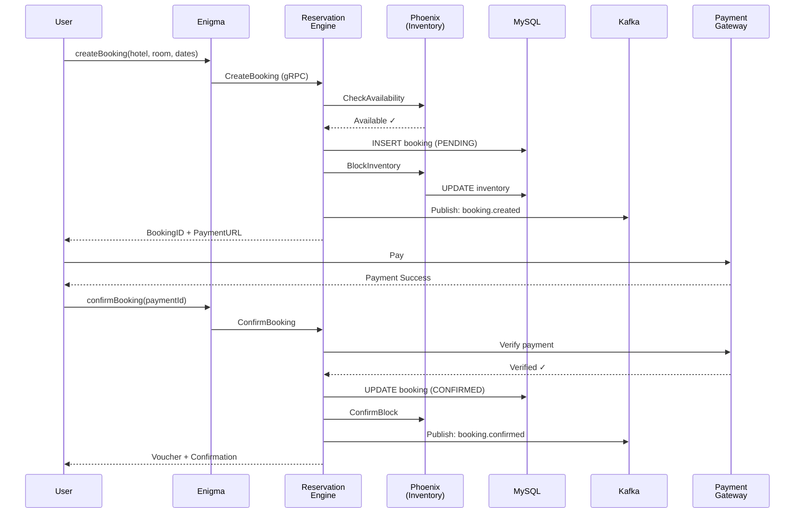
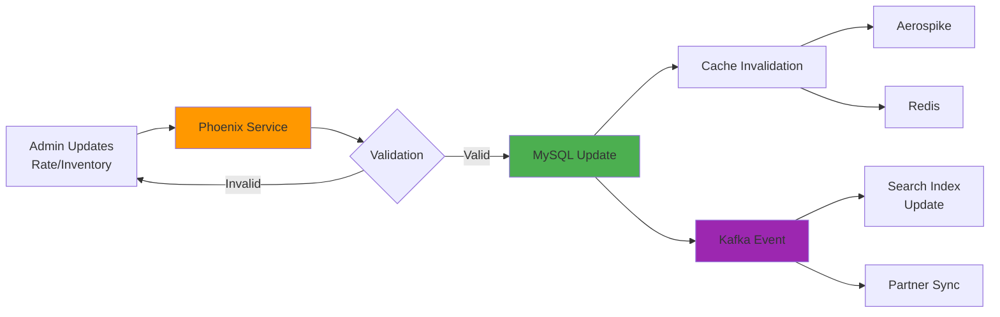
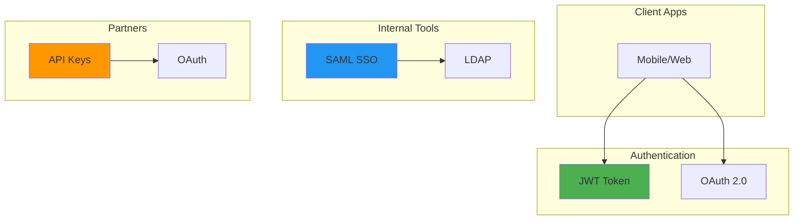
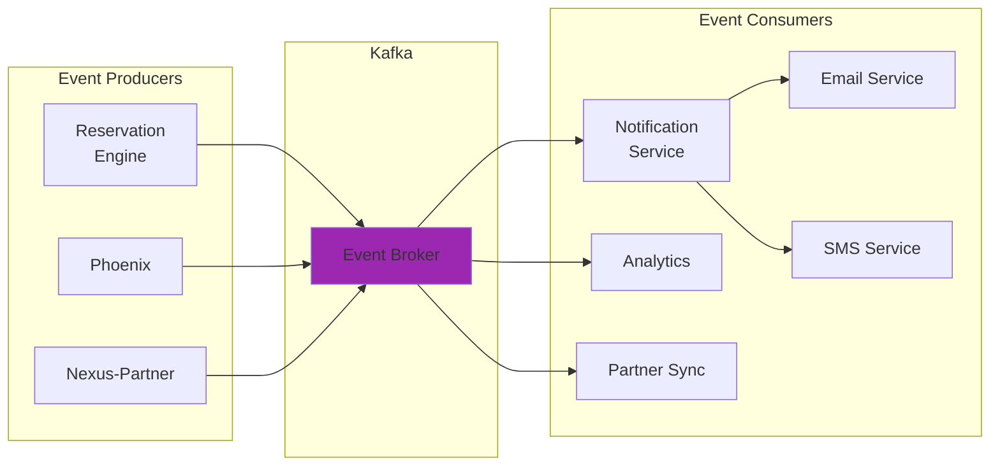

# MakeMyTrip - Architecture Overview (Visual)

## 🏗️ High-Level System Architecture



---

## 📊 Technology Stack Summary

### Programming Languages

| Language | Usage % | Services | Purpose |
|----------|---------|----------|---------|
| **Go** | 70% | 80+ services | Performance-critical microservices |
| **Java** | 20% | Content services | Content processing, aggregation |
| **Python** | 10% | Admin tools | Inventory, config management |

### Communication Protocols



### Databases & Caching

| Technology | Purpose | Scale |
|------------|---------|-------|
| **MySQL** | Transactional data (bookings, users) | Sharded (16 shards) |
| **MongoDB** | Hotel content, reviews | 10TB+ |
| **Cassandra** | Time-series (availability, events) | Petabyte scale |
| **Aerospike** | High-speed cache (search, pricing) | Sub-millisecond |
| **Redis** | Sessions, pub/sub | Distributed |

---

## 🔄 Key Workflows

### 1. Hotel Search Flow



### 2. Booking Flow



### 3. Inventory Update Flow



---

## 🗂️ Core Microservices

### INGO-Enigma (GraphQL Gateway)
```
Purpose: API aggregation for mobile/web clients
Tech: Go 1.23 + gqlgen
Files: 363 GraphQL schemas
Scale: 10,000+ req/sec

Features:
✓ Query aggregation from 50+ services
✓ Authentication & rate limiting
✓ Response transformation
✓ Error handling & retries
```

### INGO-Goku (Search & Availability)
```
Purpose: Hotel search and availability
Tech: Go 1.23 + gRPC
DB: Cassandra + Aerospike
Scale: 10,000+ searches/sec

Features:
✓ Real-time availability
✓ Multi-criteria filtering
✓ Result ranking & personalization
✓ Cache management
```

### INGO-Phoenix (Inventory Management)
```
Purpose: ARI (Availability, Rates, Inventory)
Tech: Go 1.23 + gRPC
DB: MySQL (sharded) + Aerospike
Scale: 50,000+ updates/sec

Features:
✓ Rate plan management
✓ Restriction handling
✓ Inventory blocking
✓ Real-time sync
```

### INGO-ReservationEngine
```
Purpose: Booking lifecycle management
Tech: Go 1.23 + gRPC
DB: MySQL + Redis
Scale: 1,000+ bookings/sec

Features:
✓ Booking creation & validation
✓ Payment integration
✓ Confirmation & vouchers
✓ Cancellations & modifications
```

### Hotels-Content-Services (Java)
```
Purpose: Content aggregation & serving
Tech: Java 8 + Spring Boot
DB: MongoDB + MySQL
Scale: Millions of hotels

Features:
✓ Content parsing from suppliers
✓ Image management
✓ Review aggregation
✓ Search indexing (Solr)
```

---

## 🚀 Performance Characteristics

### Latency

```
Internal gRPC calls:        2-5ms
GraphQL queries:           50-200ms
REST API calls:           100-500ms
Cache operations:          <1ms
Database queries:          5-20ms
```

### Throughput

```
Hotel searches:           10,000+ req/sec
Booking creation:          1,000+ req/sec
Inventory updates:        50,000+ updates/sec
Event processing:        100,000+ events/sec
```

### Availability

```
System uptime:            99.95%
Cache hit rate:           85%+
API success rate:         99.9%
```

---

## 🔐 Security & Authentication

### Authentication Methods



### Security Layers

1. **Network Layer**: VPC, Security Groups, WAF
2. **Application Layer**: JWT validation, Rate limiting, Input validation
3. **Data Layer**: Encryption at rest, TLS in transit
4. **Secrets Management**: AWS Secrets Manager, Kubernetes Secrets

---

## 📈 Scalability & Reliability

### Horizontal Scaling

```
Auto-scaling based on:
✓ CPU utilization (70% threshold)
✓ Memory usage (80% threshold)
✓ Request rate (per-service)
✓ Queue depth (Kafka lag)

Pod scaling: 3 (min) → 50 (max)
Scale-up time: 30 seconds
Scale-down time: 5 minutes
```

### Database Scaling

```
MySQL:
- Sharding by hotel_id (16 shards)
- Read replicas (3 per shard)
- Connection pooling (100 max)

Cassandra:
- Replication factor: 3
- Consistency: QUORUM
- Partitioning by hotel_id + date

Aerospike:
- Distributed cluster (10 nodes)
- Replication: 2x
- In-memory + SSD persistence
```

### Fault Tolerance

```
Circuit Breakers:
- Timeout: 1-5 seconds
- Error threshold: 50%
- Half-open retry: 5 seconds

Retries:
- Exponential backoff
- Max attempts: 3
- Jitter: enabled

Fallbacks:
- Cached data
- Default responses
- Graceful degradation
```

---

## 📊 Monitoring & Observability

### Metrics (Prometheus)

```go
// Key metrics tracked:
- http_requests_total
- http_request_duration_seconds
- grpc_requests_total
- grpc_request_duration_seconds
- cache_hits_total
- cache_misses_total
- bookings_created_total
- bookings_confirmed_total
- inventory_updates_total
- kafka_messages_produced
- kafka_messages_consumed
```

### Distributed Tracing (OpenTelemetry)

```
Trace components:
✓ Request ID propagation
✓ Span creation per service
✓ Parent-child span relationships
✓ Baggage for contextual data

Trace visualization:
- Jaeger UI
- Service dependency graph
- Latency breakdown
- Error tracking
```

### Logging (Zap)

```json
{
  "level": "info",
  "timestamp": "2025-01-07T12:00:00Z",
  "service": "reservation-engine",
  "request_id": "req-123456",
  "booking_id": 789012,
  "user_id": 345678,
  "action": "booking_created",
  "amount": 5000.00,
  "latency_ms": 45
}
```

---

## 🔄 Event-Driven Architecture (Kafka)

### Topic Structure

```
bookings.*
├── bookings.created
├── bookings.confirmed
├── bookings.cancelled
└── bookings.modified

inventory.*
├── inventory.rates.updated
├── inventory.availability.updated
└── inventory.restrictions.updated

payments.*
├── payments.initiated
├── payments.confirmed
└── payments.failed

notifications.*
├── notifications.email
└── notifications.sms
```

### Event Flow



---

## 💡 Best Practices Implemented

### 1. API Design
- **GraphQL**: For client flexibility
- **gRPC**: For internal performance
- **REST**: For partner compatibility
- Versioning: Semantic versioning for all APIs

### 2. Data Management
- **Sharding**: By hotel_id for horizontal scaling
- **Caching**: Multi-level (local, Redis, Aerospike)
- **Replication**: Read replicas for MySQL, RF=3 for Cassandra
- **Partitioning**: By date for time-series data

### 3. Reliability
- **Circuit Breakers**: Prevent cascade failures
- **Retries**: Exponential backoff with jitter
- **Timeouts**: Per-service timeout configuration
- **Health Checks**: Liveness & readiness probes

### 4. Observability
- **Metrics**: Prometheus + Grafana
- **Tracing**: OpenTelemetry + Jaeger
- **Logging**: Structured logging with Zap
- **Alerting**: PagerDuty integration

### 5. Security
- **Authentication**: JWT for APIs, SAML for internal tools
- **Authorization**: Role-based access control (RBAC)
- **Encryption**: TLS for transit, AES for rest
- **Secrets**: AWS Secrets Manager + K8s secrets

---

## 🎯 Key Architectural Decisions

### Why Go for Microservices?
```
✓ High performance (compiled, fast)
✓ Built-in concurrency (goroutines)
✓ Small binary size
✓ Excellent gRPC support
✓ Fast compilation
```

### Why GraphQL for Client APIs?
```
✓ Flexible queries (clients decide what they need)
✓ Single endpoint (reduces API surface)
✓ Type safety (schema validation)
✓ Reduced over-fetching
✓ Great tooling (GraphQL Playground)
```

### Why Kafka for Events?
```
✓ High throughput (millions/sec)
✓ Durability (persistence)
✓ Scalability (partitioning)
✓ Replay capability
✓ Stream processing
```

### Why Aerospike for Caching?
```
✓ Sub-millisecond latency
✓ Hybrid memory/SSD storage
✓ Strong consistency
✓ High availability
✓ Automatic rebalancing
```

---

## 📚 Related Documents

1. **[MakeMyTrip_System_Design.md](./MakeMyTrip_System_Design.md)** - Detailed technical documentation
2. **[grpc-graphql-rest-blog-article.md](../grpc-graphql-rest-blog-article.md)** - Protocol comparison
3. **[TwoSkillsDevelop.md](./TwoSkillsDevelop.md)** - Skills development plan

---

## 🚀 Getting Started

### Local Development

```bash
# Clone repositories
git clone https://github.com/yourorg/INGO-Enigma
git clone https://github.com/yourorg/INGO-Goku
git clone https://github.com/yourorg/INGO-Phoenix

# Start dependencies
docker-compose up -d mysql mongodb redis aerospike kafka

# Start services
cd INGO-Phoenix && go run main.go
cd INGO-Goku && go run main.go
cd INGO-Enigma && go run main.go

# Access GraphQL playground
open http://localhost:8080/graphql
```

### Environment Setup

```bash
# Install Go
brew install go

# Install protocol buffers compiler
brew install protobuf

# Install gRPC tools
go install google.golang.org/protobuf/cmd/protoc-gen-go@latest
go install google.golang.org/grpc/cmd/protoc-gen-go-grpc@latest

# Install GraphQL tools (gqlgen)
go install github.com/99designs/gqlgen@latest
```

---

**Last Updated**: January 7, 2026  
**Maintained by**: Platform Engineering Team  
**Version**: 1.0

