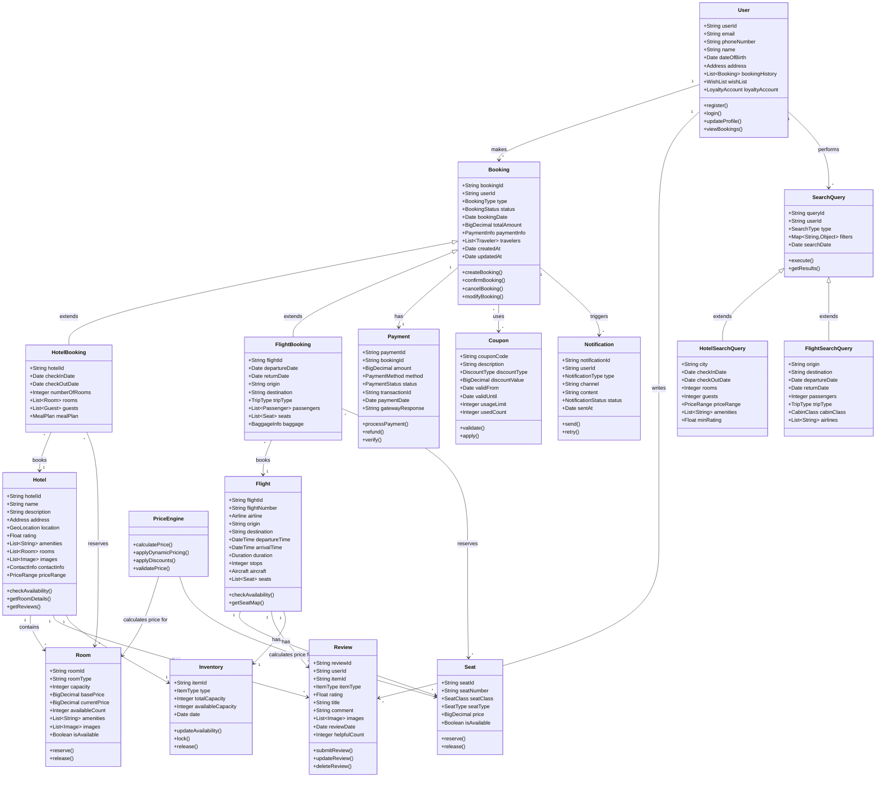
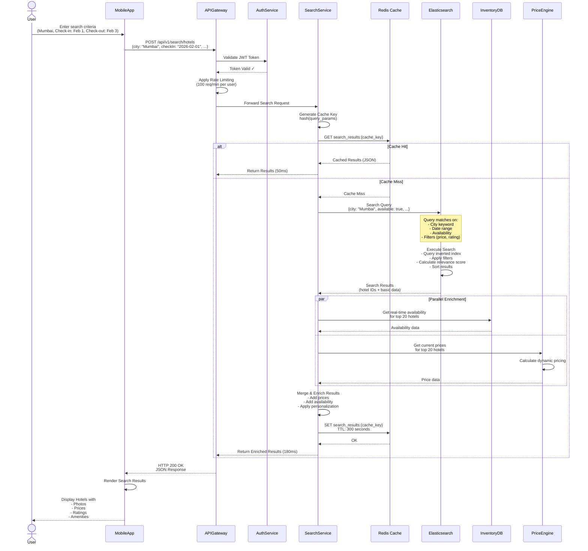
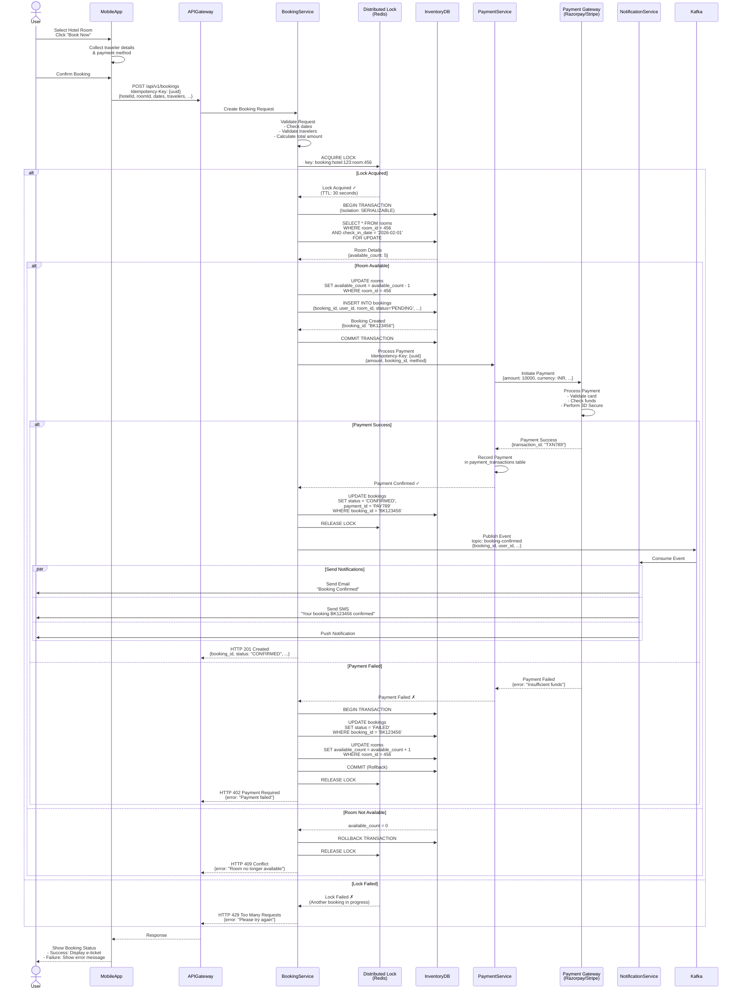
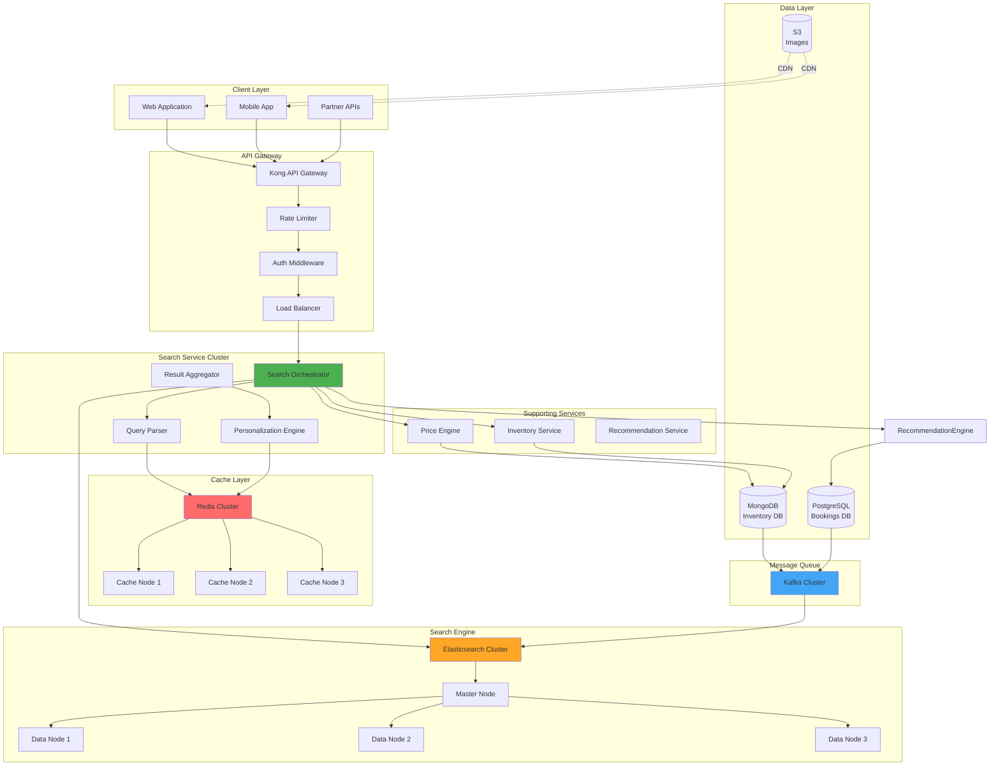
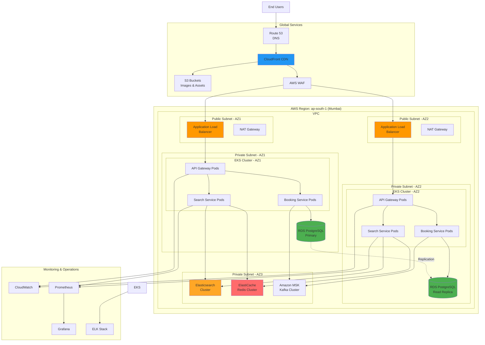
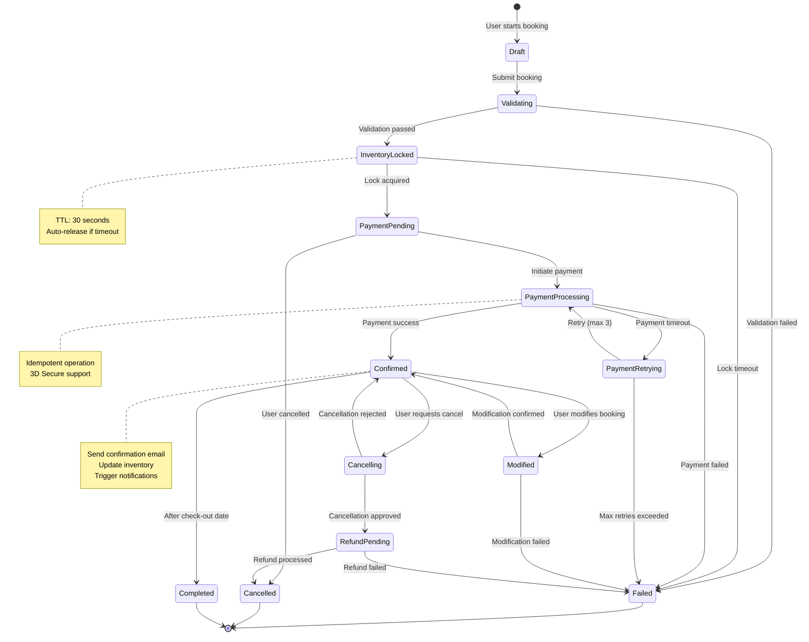
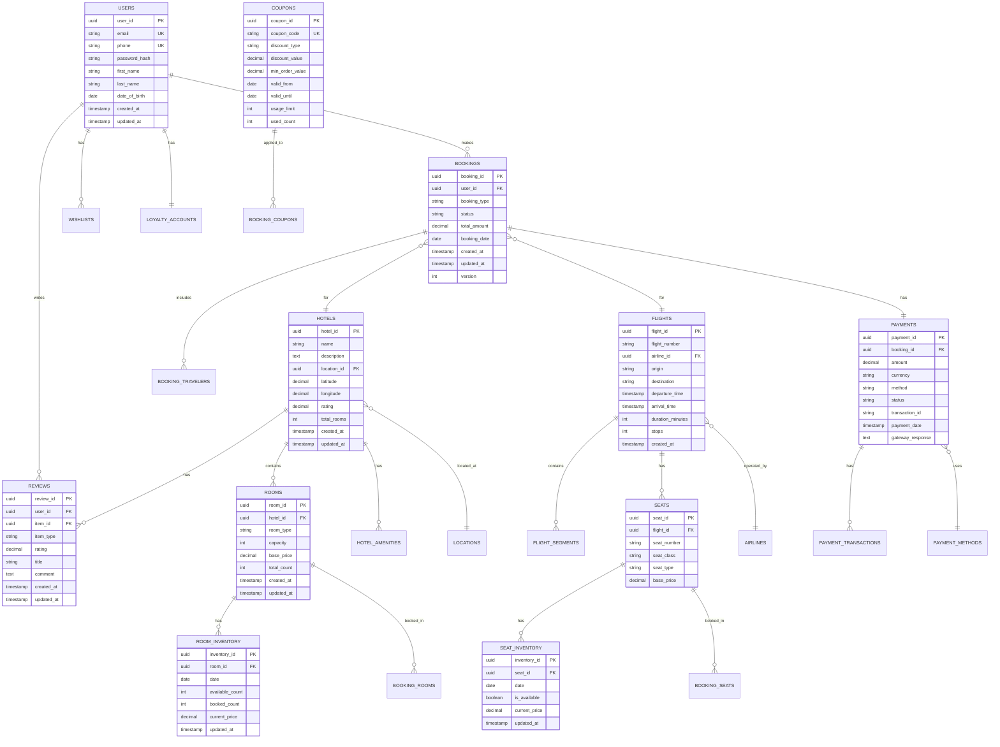

# MakeMyTrip - UML Diagrams

## 1. Class Diagram - Core Domain Model



## 2. Sequence Diagram - Hotel Search Flow



## 3. Sequence Diagram - Booking Flow with Payment



## 4. Component Diagram - Search Service Architecture



## 5. Deployment Diagram



## 6. State Diagram - Booking Lifecycle



## 7. Activity Diagram - Dynamic Pricing Calculation

```mermaid
stateDiagram-v2
    [*] --> FetchBasePrice
    
    FetchBasePrice --> CalculateDemandMultiplier
    
    CalculateDemandMultiplier --> CheckInventoryLevel
    note right of CalculateDemandMultiplier
        Use ML model to predict demand
        Historical data + current trends
    end note
    
    CheckInventoryLevel --> CalculateInventoryMultiplier
    
    CalculateInventoryMultiplier --> CheckSeasonality
    note right of CalculateInventoryMultiplier
        If occupancy > 90%: 1.4x
        If occupancy > 75%: 1.25x
        If occupancy > 50%: 1.1x
        Else: 1.0x
    end note
    
    CheckSeasonality --> CalculateSeasonalityMultiplier
    
    CalculateSeasonalityMultiplier --> CheckDayOfWeek
    note right of CalculateSeasonalityMultiplier
        Peak season: 1.5x
        High season: 1.2x
        Regular season: 1.0x
    end note
    
    CheckDayOfWeek --> CalculateDOWMultiplier
    
    CalculateDOWMultiplier --> CheckAdvanceBooking
    note right of CalculateDOWMultiplier
        Weekend: 1.2x
        Weekday: 1.0x
    end note
    
    CheckAdvanceBooking --> CalculateAdvanceMultiplier
    note right of CalculateAdvanceMultiplier
        > 30 days: 0.8x (Early bird)
        > 14 days: 0.9x
        > 7 days: 1.0x
        < 3 days: 1.3x (Last minute)
    end note
    
    CalculateAdvanceMultiplier --> CheckSpecialEvents
    
    CheckSpecialEvents --> ApplyEventMultiplier
    
    ApplyEventMultiplier --> CalculateFinalPrice
    note right of CalculateFinalPrice
        final_price = base_price × 
        demand_mult × inventory_mult × 
        seasonal_mult × dow_mult × 
        advance_mult × event_mult
    end note
    
    CalculateFinalPrice --> ApplyBusinessConstraints
    
    ApplyBusinessConstraints --> ValidateMinMargin
    note right of ApplyBusinessConstraints
        Max discount: 40%
        Max premium: 100%
        Min profit margin: 15%
    end note
    
    ValidateMinMargin --> decision1{Margin OK?}
    
    decision1 --> RoundPrice: Yes
    decision1 --> AdjustPrice: No
    
    AdjustPrice --> RoundPrice
    
    RoundPrice --> CachePrice
    note right of RoundPrice
        Round to nearest 50
        For better UX
    end note
    
    CachePrice --> [*]
```

## 8. ER Diagram - Database Schema (Core Tables)



---

## Summary

These UML diagrams provide a comprehensive view of the MakeMyTrip system:

1. **Class Diagram**: Shows the core domain model with entities and relationships
2. **Sequence Diagrams**: Illustrate the request flows for search and booking
3. **Component Diagram**: Depicts the search service architecture and interactions
4. **Deployment Diagram**: Shows the AWS infrastructure and deployment topology
5. **State Diagram**: Represents the booking lifecycle and state transitions
6. **Activity Diagram**: Details the dynamic pricing calculation workflow
7. **ER Diagram**: Presents the database schema and relationships

These diagrams complement the detailed system design document and provide visual representations of the architecture, flows, and data models.
