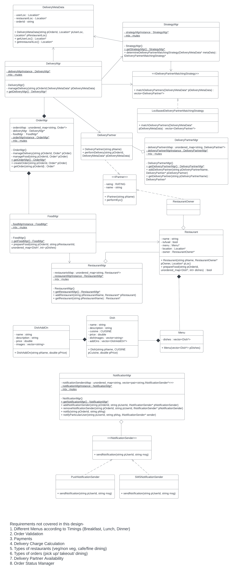

[Detailed](https://github.com/keertipurswani/Uber-Ola-Low-Level-Design)

This is demo code for LLD Bootcamp. It is not intended to be production level code and can be improved, but it sets the thought process and provides examples for how classes can be structured in a food delivery app like Swiggy or Zomato.

### Class Diagram for Zomato's online food delivery system:

#### Classes:

##### User

###### Attributes: userId, name, email, password, address
Methods: placeOrder(), cancelOrder(), viewOrderHistory()

##### Restaurant

###### Attributes: restaurantId, name, address, cuisine, rating
Methods: addMenuItem(), updateMenuItem(), viewOrders()

##### MenuItem

###### Attributes: menuItemId, name, description, price, image
Methods: none

##### Order

###### Attributes: orderId, userId, restaurantId, orderDate, total
Methods: addMenuItem(), removeMenuItem(), updateStatus()

##### Payment

###### Attributes: paymentId, orderId, amount, paymentMethod, status
Methods: processPayment(), updateStatus()

##### DeliveryPartner

###### Attributes: deliveryPartnerId, name, contactInfo
Methods: assignOrder(), updateOrderStatus()

